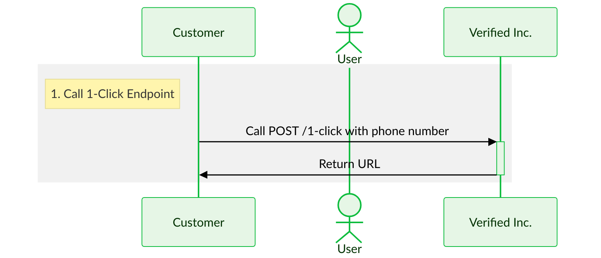
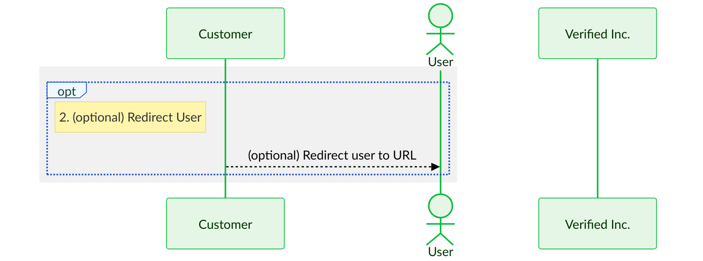
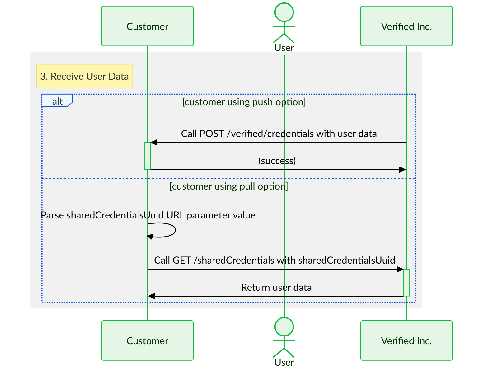
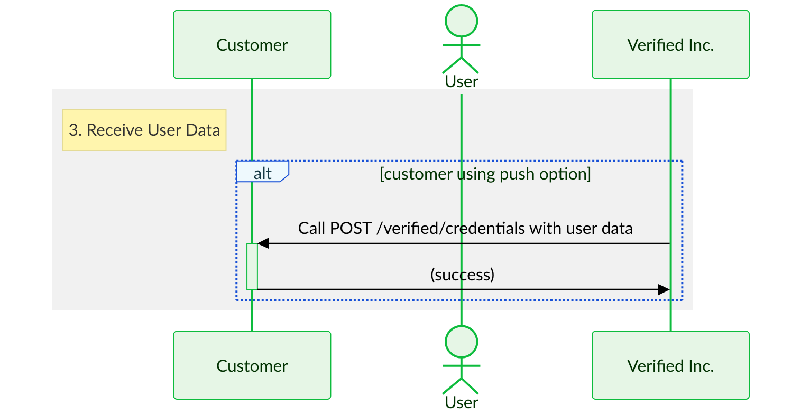
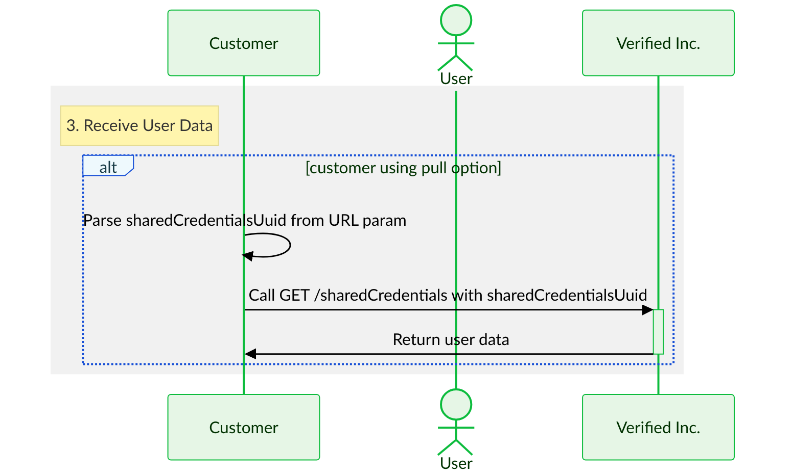
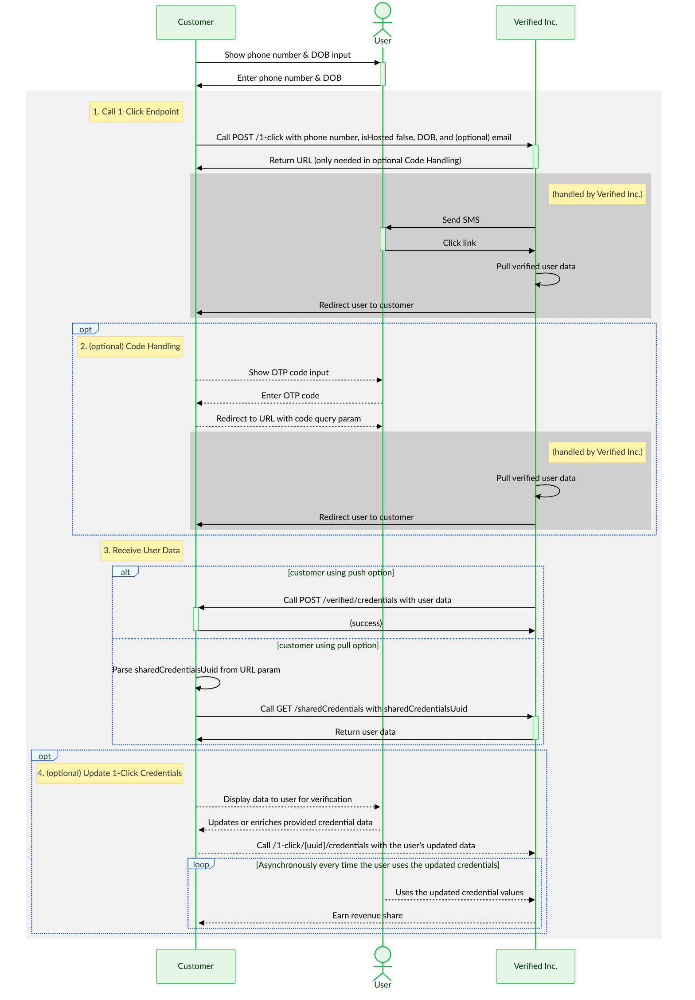
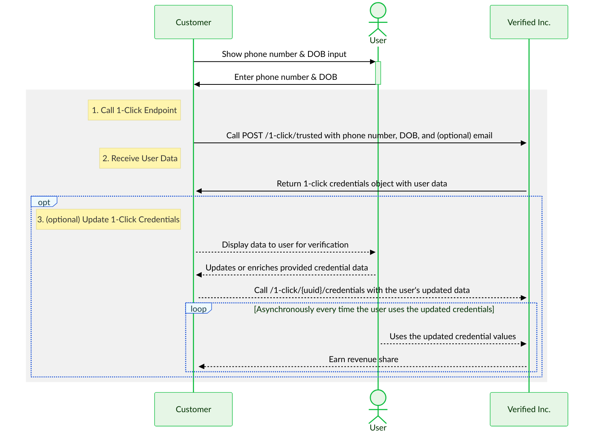

import TooltipWithDefaults from '../src/components/TooltipWithDefaults';
import Tip from '../src/components/Tip';
import Tabs from '@theme/Tabs';
import TabItem from '@theme/TabItem';
import TestingCredentialsSnippet from './reusables/sandbox-testing-credentials.mdx';
import OneClickCredentialsResponseBodyDetails from './reusables/1-click-credentials-response-body-details.mdx'
import Admonition from '@theme/Admonition';

- **Time to read:** 20 minutes
- **Time to implement:** 2-4 hours

{/* :::tip[✅ 1-Hour Guarantee]
We are _obsessed_ with making it as easy as possible for you to implement 1-Click Signup.
- If it takes you more than 1 hour to implement, we'll send you a free Verified Inc. t-shirt! 
- If it takes you less than 1 hour, we'll send you a free t-shirt _and_ mug!
::: */}

---

**1-Click Signup™ is to onboarding what 1-click checkout is to payments.** It's the fastest way for a user to sign up for your service.

With just a phone number, we can pull verified data about a user, including:
- Full Name
- Email(s)
- Phone(s)
- Address(es)
- Date of Birth
- Social Security Number

**This works for 95% of US adults (253M consumers).** The data is extremely high quality because it comes from wireless phone providers, who are required by law to perform strong identity verification (Know Your Customer). 

:::info Privacy First
**A user's data is never shared without their consent.** We are committed to putting people in control of their own data. We are SOC 2 Type II certified and compliant with major regulatory frameworks like GDPR and CCPA. For more information, please see our [Privacy, Security, and Compliance](https://www.verified.inc/privacy-security-and-compliance) page.
:::


## How It Works


### User Experience

> _**Try our [1-Click Signup demos](/demo-1-click-signup)** to see this user experience in action._

**1-Click Signup can take less than 10 seconds for a user to complete.** It usually takes around 20-30 seconds.

The user experience is simple:
1. **Enter phone number**
2. **Receive SMS with verification link/code**
3. **Click link or enter code**
4. (only if first time) **Enter DOB/SSN4**
5. **Review and consent to share data**

:::info[Step 4 Happens Only On First Time Use]
- If it's the user's first time using 1-Click Signup, they'll need to enter their date of birth (DOB) or the last 4 digits of their Social Security Number (SSN4). This is for additional verification.
- If it's _not_ the user's first time, this step will be skipped.
:::

:::tip[Without Redirect vs. With Redirect]
You can choose whether you redirect the user or not as part of the flow:
- In the [simplest implementation](#simplest-implementation), you don't redirect the user and they click a verification link in the SMS. 
- Instead, you can (optionally) [redirect the user](#redirect-user) (to a URL we provide), so they can enter a verification code from the SMS.

Both of these approaches work well but have their [pros and cons](#pros-and-cons).
:::


### Flow Diagram

Think of 1-Click Signup as a black box, where the input is a phone number and the output is verified user data:

<Tabs>
    <TabItem value="black-box" label="Black Box" default>
        You send us a phone number, and we send you verified user data, with full user consent. Yes, it's really that simple!
        ```mermaid
        %%{
            init: {
                'theme': 'base',
                'themeVariables': {
                    'primaryColor': '#e6f6e6',
                    'primaryTextColor': '#003100',
                    'primaryBorderColor': '#0dbc3d',
                    'secondaryColor': '#eef9fd',
                    'secondaryTextColor': '#193c47',
                    'secondaryBorderColor': '#164fd6',
                    'edgeLabelBackground': '#ffffff',
                    'textColor': '#000000',
                    'fontFamily': 'Lato'
                }
            }
        }%%
        flowchart TD
            A[ ] -->|phone number| 1-click-signup
            subgraph 1-click-signup [1-Click Signup]
                
            end
            1-click-signup -->|verified user data| C[ ] 

            style A fill-opacity:0, stroke-opacity:0;
            style C  fill-opacity:0, stroke-opacity:0;
        ```
    </TabItem>
    <TabItem value="partial-detail" label="Partial Detail">
        Under the hood, 1-Click Signup involves an SMS, user verification, and user consent:
        ```mermaid
        %%{
            init: {
                'theme': 'base',
                'themeVariables': {
                    'primaryColor': '#e6f6e6',
                    'primaryTextColor': '#003100',
                    'primaryBorderColor': '#0dbc3d',
                    'secondaryColor': '#eef9fd',
                    'secondaryTextColor': '#193c47',
                    'secondaryBorderColor': '#164fd6',
                    'edgeLabelBackground': '#ffffff',
                    'textColor': '#000000',
                    'fontFamily': 'Lato'
                }
            }
        }%%
        flowchart TD
            A[ ] -->|phone number| 1-click-signup
            subgraph 1-click-signup [1-Click Signup]
                B(We send user SMS) --> C(User verifies)
                C --> D(We pull verified user data)
                D --> E(User consents to share data)
            end
            1-click-signup -->|verified user data| F[ ] 

            style A fill-opacity:0, stroke-opacity:0;
            style F fill-opacity:0, stroke-opacity:0;
        ```
    </TabItem>
    <TabItem value="full-detail" label="Full Detail">
        To get even more detailed, the verification step is slightly different depending on whether it's the user's first time using 1-Click Signup or not:
        ```mermaid
        %%{
            init: {
                'theme': 'base',
                'themeVariables': {
                    'primaryColor': '#e6f6e6',
                    'primaryTextColor': '#003100',
                    'primaryBorderColor': '#0dbc3d',
                    'secondaryColor': '#eef9fd',
                    'secondaryTextColor': '#193c47',
                    'secondaryBorderColor': '#164fd6',
                    'edgeLabelBackground': '#ffffff',
                    'textColor': '#000000',
                    'fontFamily': 'Lato'
                }
            }
        }%%
        flowchart TD
            subgraph user-verifies[User verifies]
                direction TB
                B(User clicks link or enters code) --> C{User's first time?}
                C -->|yes| D(User enters DOB/SSN4)
            end
            C -->|no| E[ ]
            D --> E

            style E fill-opacity:0, stroke-opacity:0;
        ```

        In both cases, the user clicks the link or enters the code from the SMS. But if it's the user's first time using 1-Click Signup, there's an additional verification step, where they enter their date of birth or the last 4 digits of their Social Security Number. 

        So, the fully detailed flow is:

        ```mermaid
        %%{
            init: {
                'theme': 'base',
                'themeVariables': {
                    'primaryColor': '#e6f6e6',
                    'primaryTextColor': '#003100',
                    'primaryBorderColor': '#0dbc3d',
                    'secondaryColor': '#eef9fd',
                    'secondaryTextColor': '#193c47',
                    'secondaryBorderColor': '#164fd6',
                    'edgeLabelBackground': '#ffffff',
                    'textColor': '#000000',
                    'fontFamily': 'Lato'
                }
            }
        }%%
        flowchart TD
            A[ ] -->|phone number| 1-click-signup
            subgraph 1-click-signup[1-Click Signup]
                direction TB
                B(We send user SMS) --> C(User clicks link or enters code)
                subgraph user-verifies[User Verifies]
                    direction TB
                    C --> D{User's first time?}
                    D -->|yes| E(User enters DOB/SSN4)
                end
                D -->|no| F(We pull verified user data)
                E --> F
                F --> G(User consents to share data)
            end
            G -->|verified user data| H[ ] 

            style A fill-opacity:0, stroke-opacity:0;
            style H fill-opacity:0, stroke-opacity:0;
        ```
  </TabItem>
</Tabs>


### Sequence Diagram {#full-sequence-diagram}

Here's the full flow:

<Tabs>
    <TabItem value="development-diagram" label="Development" default>
        To assist getting up and running during development in our Sandbox environment, we handle sending the SMS for you by default. However, part of our [go live](#go-live) process is to switch this over to you sending the SMS as shown in the Production sequence diagram.

        ```mermaid
        %%{
            init: {
                'theme': 'base',
                'themeVariables': {
                    'primaryColor': '#e6f6e6',
                    'primaryTextColor': '#003100',
                    'primaryBorderColor': '#0dbc3d',
                    'secondaryColor': '#eef9fd',
                    'secondaryTextColor': '#193c47',
                    'secondaryBorderColor': '#164fd6',
                    'activationBkgColor': '#e6f6e6',
                    'activationBorderColor': '#0dbc3d',
                    'labelBoxBkgColor': '#eef9fd',
                    'labelBoxBorderColor': '#164fd6',
                    'labelTextColor': '#193c47',
                    'edgeLabelBackground': '#ffffff',
                    'textColor': '#000000',
                    'fontFamily': 'Lato'
                }
            }
        }%%
        sequenceDiagram
            participant C as Customer
            actor U as User
            participant V as Verified Inc.
            C->>+U: Show phone number input
            U->>-C: Enter phone number
            rect rgb(200,200,200,0.25)
                note left of C: 1. Call 1-Click Endpoint
                C->>+V: Call POST /1-click with phone number
                V->>-C: Return URL
                opt
                    note left of C: 2. (optional) Redirect User
                    C-->>U: (optional) Redirect user to URL
                end
                rect rgb(200,200,200,0.85)
                    note right of V: (handled by Verified Inc.)
                    V->>+U: Send SMS
                    U->>-V: Click link or enter code
                    alt is user's first time
                        V->>+U: Show DOB/SSN4 input
                        U->>-V: Enter DOB/SSN4
                    end
                    V->>V: Pull verified user data
                    V->>+U: Display data
                    U->>-V: Consent to share data
                    V->>C: Redirect user to customer
                end
                note left of C: 3. Receive User Data
                alt customer using push option
                    V->>+C: Call POST /verified/credentials with user data
                    C->>-V: (success)
                else customer using pull option
                    C->>C: Parse sharedCredentialsUuid from URL param
                    C->>+V: Call GET /sharedCredentials with sharedCredentialsUuid
                    V->>-C: Return user data
                end
            end
        ```
    </TabItem>
    <TabItem value="production-diagram" label="Production" default>
        ```mermaid
        %%{
            init: {
                'theme': 'base',
                'themeVariables': {
                    'primaryColor': '#e6f6e6',
                    'primaryTextColor': '#003100',
                    'primaryBorderColor': '#0dbc3d',
                    'secondaryColor': '#eef9fd',
                    'secondaryTextColor': '#193c47',
                    'secondaryBorderColor': '#164fd6',
                    'activationBkgColor': '#e6f6e6',
                    'activationBorderColor': '#0dbc3d',
                    'labelBoxBkgColor': '#eef9fd',
                    'labelBoxBorderColor': '#164fd6',
                    'labelTextColor': '#193c47',
                    'edgeLabelBackground': '#ffffff',
                    'textColor': '#000000',
                    'fontFamily': 'Lato'
                }
            }
        }%%
        sequenceDiagram
            participant C as Customer
            actor U as User
            participant V as Verified Inc.
            C->>+U: Show phone number input
            U->>-C: Enter phone number
            rect rgb(200,200,200,0.25)
                note left of C: 1. Call 1-Click Endpoint
                C->>+V: Call POST /1-click with phone number
                V->>-C: Return URL and SMS body
                C->>+U: Send SMS
                opt
                    note left of C: 2. (optional) Redirect User
                    C-->>U: (optional) Redirect user to URL
                end
                rect rgb(200,200,200,0.85)
                    note right of V: (handled by Verified Inc.)
                    U->>-V: Click link or enter code
                    alt is user's first time
                        V->>+U: Show DOB/SSN4 input
                        U->>-V: Enter DOB/SSN4
                    end
                    V->>V: Pull verified user data
                    V->>+U: Display data
                    U->>-V: Consent to share data
                    V->>C: Redirect user to customer
                end
                note left of C: 3. Receive User Data
                alt customer using push option
                    V->>+C: Call POST /verified/credentials with user data
                    C->>-V: (success)
                else customer using pull option
                    C->>C: Parse sharedCredentialsUuid from URL param
                    C->>+V: Call GET /sharedCredentials with sharedCredentialsUuid
                    V->>-C: Return user data
                end
            end
        ```
    </TabItem>
</Tabs>

## Implement

> _**Try our [1-Click Signup demos](/demo-1-click-signup)** to see example implementations. These are open source, so feel free to use the [source code](https://github.com/VerifiedInc/Kredita-Demo-Web) as a reference._

### 3 Steps to Implement

To implement 1-Click Signup, there are only 3 steps (and one is optional):
1. **[Call 1-Click endpoint](#call-1-click-endpoint)**
2. (optional) **[Redirect user](#redirect-user)**
3. **[Receive user data](#receive-user-data)**

See the [sequence diagram](#sequence-diagram) above.

<TestingCredentialsSnippet/>
:::tip
**We also strongly recommend that you test using your own phone number.** This will allow you to receive SMS messages, which are necessary to test the full 1-Click Signup flow (but won't work for the test user).
<details>
    <summary><b>Phone Number Format</b></summary>

    Make sure to use a 10-digit string, with the `+1` country code at the beginning:
    ```text title="Phone"
    +10123456789
    ```
    Currently, only US phone numbers work with 1-Click Signup (and we're able to source verified data for 95% of these numbers).
</details>
Using your own phone number in sandbox, you'll receive dummy user data.
:::

#### Simplest Implementation

For the simplest implementation:
1. Call 1-Click endpoint with a [basic request](#basic-request)
2. ~Redirect user~ (skip optional step)
3. Receive user data using the [pull option](#pull-option)

### 1. Call 1-Click Endpoint {#call-1-click-endpoint}

The 1-Click endpoint is [`POST /1-click`](/api-reference#1-click). Call it with the user's phone number to start 1-Click Signup.


#### Sequence Diagram



[↑ Full Sequence Diagram](#full-sequence-diagram)


#### Basic Request

Just include a phone number:

```typescript title="POST /1-click Request Body"
{
    "phone": "+10123456789"
}
```


#### Advanced Request

You can also use `/1-click` in more advanced ways:

<details>
    <summary><b>Optimize for Redirect</b></summary>

    If you're going to [redirect the user](#redirect-user) to us (which is optional), you should add 
    `"verificationOptions": "only_code"` to the request body:

    ```typescript title="POST /1-click Request Body"
    {
        "phone": "+10123456789",
        "verificationOptions": "only_code"
    }
    ```

    This makes the SMS body contain a verification code rather than a link, which can cause confusion.

    You can also use `"verificationOptions": "both_link_and_code"` to make the SMS contain both a verification link and code. This gives the user the option of using either one.
</details>

<details>
    <summary><b>Change the Word After "1-Click"</b></summary>

    If "1-Click Signup" isn't the best phrase for your use case, you can change the last word to "Verify" or "Apply"" like this:

    ```typescript title="POST /1-click Request Body"
    {
        "phone": "+10123456789",
        "content": {
            "title": "Verify"
        }
    }
    ```

    If neither of these is ideal for you, reach out to us about what would be better, and we'll gladly consider adding more options.
</details>

<details>
    <summary><b>Define a Redirect URL</b></summary>

    When we create an API key for your brand — email us at Support@Verified.Inc if you need one — we define a default redirect URL. This is where we will redirect the user after they consent (or decline) to share data with you. It's "global" to your brand in the sense that it applies to any 1-Click Signup flow you initiate.

    However, you can also define a redirect URL "on the fly" that applies only to the specific 1-Click Signup flow you just initiated. To do this, just include the optional `redirectUrl` attribute:

    ```typescript title="POST /1-click Request Body"
    {
        "phone": "+10123456789",
        "redirectUrl": "https://example.com"
    }
    ```

    This overrides the default redirect URL for your brand. 
</details>

<details>
    <summary><b>Change Data Types Requested</b></summary>

    If you only need a subset of the verified user data we can return, you can limit the data types requested like this:

    ```typescript title="POST /1-click Request Body"
    {
        "phone": "+10123456789",
        "credentialRequests": [
            "FullNameCredential",
            "EmailCredential",
            "PhoneCredential",
            "AddressCredential"
        ]
    }
    ```

    The default types are:
    - `FullNameCredential`
    - `EmailCredential`
    - `PhoneCredential`
    - `AddressCredential`
    - `BirthDateCredential`
    - `SsnCredential`

    You can also request additional data types — `EmployerNameCredential`, `AnnualIncomeCredential`, and many more. See the full list of available types in our [schema library](/schema#schema-library)

    <Admonition type="warning">
    **We aren't always able to source data for types beyond the defaults listed above.** If we aren't able to, we allow the user to input data in a simple form interface.
    
    We're soon adding more data sources, so we'll be able to expand the default types over time.
    </Admonition>
</details>

<details>
    <summary><b>Fully Customize Data Request</b></summary>

    You can fully customize the data request, controlling things like:
    - whether user input is allowed
    - whether a given piece of data is required or optional
    - which issuers issued the verified data

    We are happy to help you customize this. Just email us at Support@Verified.Inc if you'd like help doing so.

    Here's an example of a fully customized request:

    ```typescript title="POST /1-click Request Body"
    {
        "phone": "+10123456789",
        "credentialRequests": [
            {
                "type": "FullNameCredential",
                "issuers": ["{{verifiedIncIssuerBrandUuid}}"],
                "allowUserInput": true,
                "mandatory": "if_available",
                "description": "Your full legal name",
                "children": [
                    {
                        "type": "FirstNameCredential"
                    },
                    {
                        "type": "LastNameCredential"
                    }
                ]
            },
            {
                "type": "EmailCredential",
                "issuers": ["{{verifiedIncIssuerBrandUuid}}"],
                "allowUserInput": true,
                "mandatory": "if_available"
            },
            {
                "type": "PhoneCredential",
                "issuers": ["{{verifiedIncIssuerBrandUuid}}"],
                "mandatory": "yes",
                "description": "We only send important account updates, never spam"
            },
            {
                "type": "AddressCredential",
                "issuers": ["{{verifiedIncIssuerBrandUuid}}"],
                "allowUserInput": true,
                "mandatory": "if_available",
                "children": [
                    {
                        "type": "Line1Credential"
                    },
                    {
                        "type": "Line2Credential",
                        "mandatory": no
                    },
                    {
                        "type": "CityCredential"
                    },
                    {
                        "type": "StateCredential"
                    },
                    {
                        "type": "CountryCredential"
                    },
                    {
                        "type": "ZipCodeCredential"
                    }
                ]
            },
        ]
    }
    ```
</details>


#### Response

If 1-Click Signup is possible for the phone number included in the request body, the response body will contain a URL and a boolean indicating whether the phone number matches a user in our system.

```typescript title="POST /1-click Response Body"
{
    "url": "https://wallet.verified.inc/request/9f2053fc-cc4c-41cb-8d14-7d3ccf6167eb",
    "match": true,
    "smsBody": "Click this link to verify for Hooli: https://wallet.verified.inc/mt/3070e04e-dfdd-4600-954a-6ddaf651c65c" // only necessary to use in production, where you send the SMS
}
```

If you are going to [redirect the user](#redirect-user) (which is optional), you should redirect them to the returned `url`. If you aren't going to redirect them, you can ignore this URL.

If 1-Click Signup is _not_ possible, the response body `match` value will be `false` or contain an error.

You can ignore `smsBody` in sandbox, where we handle sending SMS for you to make it simpler to start integrating. But when you're ready to [go live](#go-live), where you will send the SMS, you should trigger and SMS to the user that contains `smsBody`.


### 2. (optional) Redirect User {#redirect-user}

Optionally, you can redirect the user to the URL contained in the 1-Click endpoint [response](#response). This is a link to our Wallet, where the user will review and consent to share their verified data.

:::note[Redirecting the User Is Not Necessary]
They will end up at our Wallet either way:
- If you do _not_ redirect the user, they will click a verification link in the SMS that takes them to the Wallet.
- If you _do_ redirect the user, that will take them to the Wallet, where they will enter a verification code.

See below for the [pros and cons](#pros-and-cons) of these two approaches.
:::


#### Sequence Diagram



[↑ Full Sequence Diagram](#full-sequence-diagram)


#### Pros and Cons

There are pros and cons to redirecting the user:

<details>
    <summary><b>Pros</b></summary>
    1. **It allows the user to enter a verification code.** This can usually be done without switching to the messages app because of autofill features in mobile operating systems. (Clicking a verification link in the SMS requires switching to the messages app.)
    2. **It allows you to keep the user in the same context.** If they start in a particular browser, by redirecting you can ensure they stay in that browser. (If they click the link, the mobile operating system may open it in a different browser.) If they start in a mobile app, you can open a webview within that app so they aren't taken away from it. (We recommend a full page webview, so it feels like part of the app.)
</details>
<details>
    <summary><b>Cons</b></summary>
    1. **It's not ideal on non-mobile devices.** That's because ultimately the user has to verify on their mobile device — it's what allows us to pull verified data from the user's wireless phone provider. So if you redirect the user on a non-mobile device, our Wallet will display a QR code to direct them to their phone, which works but is not the best experience. Therefore, we recommend that if you redirect the user at all that you first check if they're on a mobile device and only do the redirect in that case.
    2. **It's slightly more work to implement.** The [simplest implementation](#simplest-implementation) is not redirecting the user.
</details>


### 3. Receive User Data {#receive-user-data}

After you [call the 1-Click endpoint](#call-1-click-endpoint), you need to be set up to receive data the user consents to share with you.

There are two options for how to do this:
1. **[Push Option](#push-option) (recommended):** We _push_ the data to you, by hitting an endpoint you provide.

OR

2. **[Pull Option](#pull-option):** You _pull_ the data from us, by hitting an endpoint we provide.

:::tip[We Recommend the Push Option]
We recommend the push option because you are guaranteed to receive the data immediately, as soon as the user consents to share it. That results in 100% conversion.

With the pull option, there's a time delay between when the user consents to share and when you are able to pull the data. That's because we have to redirect the user to you first. Conversion is generally somewhat less than 100% in this case.
:::


#### Sequence Diagram



[↑ Full Sequence Diagram](#full-sequence-diagram)


#### Push Option (recommended) {#push-option}

All you need to do is create a webhook called `POST /verified/credentials` according to our [OpenAPI spec](https://gist.github.com/VerifiedIncMachine/ef399f6b5ce6545eb4d7ec3e85d87dd2). This is where we will send verified user data when a user consents to share it.



[↑ Full Sequence Diagram](#full-sequence-diagram)


#### Pull Option

Here's how this option works:
1. We redirect to your `redirectUrl` and include a URL parameter called `1ClickUuid`.
2. You call our [`GET /1-click`](/api-reference#get-1-click-credentials) endpoint with the value of this parameter.


#### Sequence Diagram



[↑ Full Sequence Diagram](#full-sequence-diagram)


#### Response

The user data you'll receive is the same, regardless of whether you use the push or pull option. 

:::tip
One particularly valuable piece of metadata is **`verificationMethod`**, which describes how the credential (piece of user data) was verified. It can take the following values:
- `"phone_carrier"`: verified via phone carrier records
- `"otp"`: verified via an OTP (one time passcode)
- `"self_attested"`: attested by the user themselves (not verified)
- `null`
:::

<details>
    <summary>Definitions</summary>
    - An **identifier** is a phone number or email address the user uses to verify for 1-Click Signup.
        - `identifierType` is the type of identifier (`phone` or `email`).
    - A **credential** is a piece of data the user shares (e.g. birth date or SSN).
        - A **credential type** is a string indicating the type of a credential (e.g. `SsnCredential` or `FirstNameCredential`). It's formatted in `PascalCase` and always includes the word `Credential` at the end.
        - `shortenedCredentialType` is the shortened credential type in `camelCase`. The shortened credential type is just the type without the word `Credential` (e.g. `birthDate` or `ssn`). For subcredentials of a composite credential, it includes the shortened credential type of its parent credential(s) (e.g. `fullName.firstName`). 
            <details>
            <summary>Accepted Values</summary>

            Currently, accepted values for `shortenedCredentialType` are:
                - `email`
                - `fullName.firstName`
                - `fullName.middleName`
                - `fullName.lastName`
                - `birthDate`
                - `address.line1`
                - `address.line2`
                - `address.city`
                - `address.state`
                - `address.zipCode`
                - `address.country`
                - `ssn`
            </details>
    - **Data** in this context means identity information about a user (e.g. their name, contact information, etc.)
    - **Metadata** in this context means any additional data that's _not_ identity information about a user (e.g. the verification method for their identity information).
        - `metadataType` is the type of metadata. 
            <details>
            <summary>Accepted Values</summary>

            Currently, possible values for `metadataType` are:
                - `id`: unique identifier for a credential
                    - UUID
                    - Applies only to credentials
                - `verificationMethod`: how an identifier or credential was verified
                    - enum: `"phone_carrier"`, `"otp"`, `"self_attested"`, or `null` 
                    - Applies to both identifiers and credentials
                - `status`: status of a credential
                    - enum: `"valid"` or `"revoked"`
                    - Applies only to credentials
                - `issuerUuid`: brand that issued a credential
                    - UUID
                    - Applies only to credentials
                - `issuanceDate`: date a credential was issued
                    - Unix timestamp
                    - Applies only to credentials
                - `expirationDate`: date a credential expires
                    - Unix timestamp
                    - Applies only to credentials
            </details>
</details>

```typescript title="Data the User Shared"
{
    "identifiers": {
        "phone": "+101234567890"
    },
    "credentials": {
        "email": "richard@piedpiper.net",
        "fullName": {
            "firstName": "Richard",
            "lastName": "Hendricks"
        },
        "birthDate": "08/01/1989",
        "address": {
            "line1": "5320 Newell Rd",
            "city": "Palo Alto",
            "state": "CA",
            "zip": "94303",
            "country": "US"
        },
        "ssn": "123456789"
    },
    "metadata": {
        "identifiers": {
            "verificationMethod": {
                "phone": "phone_carrier"
            }
        },
        "credentials": {
            "id": {
                "email": "8a1d4e35-413d-496b-b499-8810b55cfb5c",
                "fullName": {
                    "firstName": "2e6a7b9a-e93e-43ba-98a9-c554f4e16457",
                    "lastName": "9a5817ef-e621-4277-8c48-c8ee3776b6c4"
                },
                "birthDate": "ec1ef0ce-eeed-46a4-94a9-29b46e64403d",
                "address": {
                    "line1": "f5a4dc93-bc06-4bb8-bd05-17b5ba912bcd",
                    "city": "efd3820f-676a-4db1-b63e-695b66ed8ba0",
                    "state": "b65022a2-2016-41df-88f3-252e8e3a29c5",
                    "zip": "b747ff84-39d8-4df9-98f9-24a465f1a9ae",
                    "country": "d57a7bca-2a7c-4671-86ad-5647731cad02"
                },
                "ssn": "ec1ef0ce-eeed-46a4-94a9-29b46e64403d"
            },
            "verificationMethod": {
                "email": "phone_carrier",
                "fullName": {
                    "firstName": "phone_carrier",
                    "lastName": "phone_carrier"
                },
                "birthDate": "phone_carrier",
                "address": {
                    "line1": "phone_carrier",
                    "city": "phone_carrier",
                    "state": "phone_carrier",
                    "zip": "phone_carrier",
                    "country": "phone_carrier"
                },
                "ssn": "phone_carrier"
            },
            "status": {
                "email": "valid",
                "fullName": {
                    "firstName": "valid",
                    "lastName": "valid"
                },
                "birthDate": "valid",
                "address": {
                    "line1": "valid",
                    "city": "valid",
                    "state": "valid",
                    "zip": "valid",
                    "country": "valid"
                },
                "ssn": "valid"
            },
            "issuerUuid": {
                "email": "c3be0124-8f03-4983-baef-3302e0be88f4",
                "fullName": {
                    "firstName": "c3be0124-8f03-4983-baef-3302e0be88f4",
                    "lastName": "c3be0124-8f03-4983-baef-3302e0be88f4"
                },
                "birthDate": "c3be0124-8f03-4983-baef-3302e0be88f4",
                "address": {
                    "line1": "c3be0124-8f03-4983-baef-3302e0be88f4",
                    "city": "c3be0124-8f03-4983-baef-3302e0be88f4",
                    "state": "c3be0124-8f03-4983-baef-3302e0be88f4",
                    "zip": "c3be0124-8f03-4983-baef-3302e0be88f4",
                    "country": "c3be0124-8f03-4983-baef-3302e0be88f4"
                },
                "ssn": "c3be0124-8f03-4983-baef-3302e0be88f4"
            },
            "issuanceDate": {
                "email": "1671847264479",
                "fullName": {
                    "firstName": "1671847264479",
                    "lastName": "1671847264479"
                },
                "birthDate": "1671847264479",
                "address": {
                    "line1": "1671847264479",
                    "city": "1671847264479",
                    "state": "1671847264479",
                    "zip": "1671847264479",
                    "country": "1671847264479"
                },
                "ssn": "1671847264479"
            },
            "expirationDate": {
                "email": "1871839024044",
                "fullName": {
                    "firstName": "1871839024044",
                    "lastName": "1871839024044"
                },
                "birthDate": "1871839024044",
                "address": {
                    "line1": "1871839024044",
                    "city": "1871839024044",
                    "state": "1871839024044",
                    "zip": "1871839024044",
                    "country": "1871839024044"
                },
                "ssn": "1871839024044"
            }
        }
    }
}
```


### Go Live!

Before you launch 1-Click Signup live in production, you'll need to do 2 things that are not necessary in sandbox:
1. **Add legal language to ensure compliance:** SMS regulations require that users give informed consent, so you must include the following language just above or below the phone number input you use to start the 1-Click Signup flow. (It can be included alongside other legal language you already use.)

    > By `{taking this action}`, you agree to receive a text to create a Verified Inc. account for 1-Click Signup at `{your brand name}` and other supported sites.

    <details>
        <summary>Replace `{taking this action}` and `{your brand name}`</summary>

        <p>
            <ol>
                <li>
                    **Replace `{taking this action}` with the action the user takes to trigger the 1-Click Signup flow.** For example:
                        <ul> 
                            <li>
                                If your implementation automatically calls `POST /1-click` when the user enters a valid phone number, replace `{taking this action}` with "entering your phone number".
                            </li>
                            <li>
                                If your implementation calls `POST /1-click` when the user clicks a Next button after entering their phone number, replace `{taking this action}` with "clicking Next".
                            </li>
                            <li>
                                If there are multiple possible triggers, replace `{taking this action}` with "continuing" so it's general enough to cover all cases.
                            </li>
                        </ul>
                </li>
                <li>
                    **Replace `{your brand name}` with your brand name.**
                </li>
            </ol>
        </p>

        <p>
            Here's a full example, with these replacements:
            > By entering your phone number, you agree to receive a text to create a Verified Inc. account for 1-Click Signup at Hooli and other supported sites.
        </p>
    </details>

    <details>
        <summary>Optionally include a "powered by" graphic</summary>

        **We encourage (but don't require) you to include a graphic that says "1-Click Signup powered by Verified Inc."** This helps the user understand they're about to go through a 1-Click Signup flow — and motivates them to do so, since a 1-click experience is always best!

        The graphic should be placed just below the phone number input you use to start the 1-Click Signup flow.
        
        We provide several variants of the graphic, in both SVG and PNG format. Choose the one you prefer and that best fits the background color of your application.

        **Green**
            
            <a download="green.svg" href="/img/1-click-signup-powered-by-verified-inc/svg/green.svg" title="Green (SVG)">Download SVG</a> | 
            <a download="green.svg" href="/img/1-click-signup-powered-by-verified-inc/png/green.png" title="Green (PNG)">Download PNG</a>

            **Black**
            
            <a download="green.svg" href="/img/1-click-signup-powered-by-verified-inc/svg/black.svg" title="Black (SVG)">Download SVG</a> | 
            <a download="green.svg" href="/img/1-click-signup-powered-by-verified-inc/png/black.png" title="Black (PNG)">Download PNG</a>

            **Gray**
            
            <a download="green.svg" href="/img/1-click-signup-powered-by-verified-inc/svg/gray.svg" title="Gray (SVG)">Download SVG</a> | 
            <a download="green.svg" href="/img/1-click-signup-powered-by-verified-inc/png/gray.png" title="Gray (PNG)">Download PNG</a>

            **White**
            
            <a download="green.svg" href="/img/1-click-signup-powered-by-verified-inc/svg/white.svg" title="White (SVG)">Download SVG</a> | 
            <a download="green.svg" href="/img/1-click-signup-powered-by-verified-inc/png/white.png" title="White (PNG)">Download PNG</a>
    </details>

    Here's an example:

    
    *Hooli displays the required legal language and includes the gray variant of the "powered by" graphic.*

2. **Send SMS:** When you're ready to go live, we'll enable `POST /1-click` to return one additional attribute, `smsBody`, which contains the content of the SMS the user should receive. It's not necessary for you to send SMS in sandbox — we handle it for you to make it easier to get started — but you should do so in production. This is to avoid user confusion (so all SMS you send come from the same number) and ensure compliance with recent regulations about informed consent for SMS.


#### Production Ready Checklist

<input type="checkbox" id="legal"/>
<label for="legal">**You've included the required legal language.**</label>
<br/>
<input type="checkbox" id="sms"/>
<label for="sms">**You're set up to send SMS to users.**</label>
<br/>
<input type="checkbox" id="testing"/>
<label for="testing">**You've tested the 1-Click Signup flow end-to-end.**</label>
<br/>
<br/>

Once we've confirmed that you've checked off these items, you're ready to go live!


## Non-Hosted Variant

The 1-Click Signup experience mentioned above outlines our "hosted" 1-Click Signup flow, where the user interacts with our Wallet. We also offer a non-hosted or "headless" 1-Click Signup flow, which allows for a more white-label integration where the user will never have to leave your signup flow. You will receive the data as soon the user clicks the verification link in the SMS or enters the verification code via your UI (and a headless redirect is initiated to us, more on that below).

This method requires additional work; mainly, you will have to build a UI for the user to interact with. However, often, this is just augmenting your existing signup forms. While the rest is very similar to the hosted flow, there are a few differences:

1. **Call `/1-click` with two additional request attributes: `isHosted` and `birthDate.`** 

    ```json title="POST /1-click Request Body (Non-Hosted Additional Attributes)"
    isHosted: false,
    birthDate: "YYYY-MM-DD",
    ```

    The `birthDate` value often must come from signup forms. We recommend collecting this alongside their phone number.

2. **Regardless of your method of receiving the data ([push](#push-option) or [pull](#pull-option)), the data provided ought to be prefilled in your existing signup forms.** This is to allow the user to edit any fields that may have been incorrect or add any additional information that may be required. It is necessary to allow the user to edit the data for correctness. Also, the response body may contain multiple credentials of the same type (e.g., addresses), and you will need to handle this in your UI. The simplest solution is to provide the most recently issued credential field and have them edit it if necessary.

3. **If using `verificationOptions` containing a code, you will need to build the input for the user to submit the OTP code sent to them via SMS.** This only needs to be handled if you are using `verificationOptions` set to `only_code` or `both_link_and_code`.

    Upon collecting the verification code from the user, you must redirect the user to the `/1-click` response body's `url` with the user-provided verification code as a query parameter. Below is an example response body:

    ```typescript title="Example URL Response Body"
    {
        "url": "https://wallet.verified.inc/authentication/verify/generic?phone=%2B101234566789&phoneCarrier=true&requestId=242189ee-c120-4f62-af85-a0a19423ffc0&issuePhoneCarrierCredentials=false&isHosted=false",
        "match": true,
        "uuid": "242189ee-c120-4f62-af85-a0a19423ffc0"
    }
    ```

    The resultant URL that you need to redirect to would look like this:

    ```typescript title="Redirect URL Post User Inputted OTP Code"
    https://wallet.verified.inc/authentication/verify/generic?code=123456&phone=%2B10123456789&phoneCarrier=true&requestId=242189ee-c120-4f62-af85-a0a19423ffc0&issuePhoneCarrierCredentials=false&isHosted=false
    ```

    This redirect will ultimately land the user back on your defined `redirectUrl` with no user interaction appearing as if only a page refresh has occurred.

4. **If using `verificationOptions` `only_link` then the `/1-click` response body will not contain a `url` even if `match` is `true`.** This is because there is no need to redirect the user. Thanks to the verification link sent via SMS already containing the code, there is no need for a redirect. Upon clicking the link, we will redirect the user to your defined `redirectUrl` upon phone verification and credential creation happening in a headless manner.

### Diagram {#non-hosted-variant-diagram}



*Please note that, just as in the hosted flow, Verified Inc. will send the SMS on your behalf in sandbox, but you will need send the SMS in production (the same [go live](/#go-live) checklist applies).*


## Trusted Variant

The [`/1-click/trusted`](/api-reference#trusted-1-click) flow is in many ways similar to the [non-hosted](/#non-hosted-variant) flow documented above, but it does not require your brand to use the OTP provided by the `/1-click` non-hosted response body. This variant is most appropriate for organizations that already use a phone authentication solution. As the name implies, it requires additional verification by Verified Inc. during the integration's development to ensure that phone possession is checked, often via a SMS one-time passcode, during the current user session prior to calling this endpoint.

The notable differences between the trusted and non-hosted variants are:

1. **The endpoint is `/1-click/trusted` not `/1-click`.** This endpoint's request body resembles `/1-click`'s but the response body does not.

    <OneClickCredentialsResponseBodyDetails />

2. **1-click credential data is return synchronously by this endpoint.**

    In the non-hosted `/1-click` flow, you need to send the OTP back to us once you've received it from the user, and we pass back the user's data asynchronously via methods documented in the [receive user data](/#receive-user-data) section above.

If you're interested in this type of integration, please let us know and we will enable it for your API key. Please note that we will have to validate your integration in sandbox prior to sharing production access to this feature.

### Diagram {#trusted-variant-diagram}


