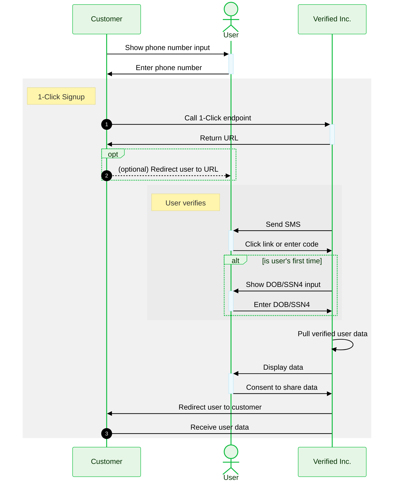

import TooltipWithDefaults from '../src/components/TooltipWithDefaults';
import Tip from '../src/components/Tip';
import Tabs from '@theme/Tabs';
import TabItem from '@theme/TabItem';

**Time to read:** 10 minutes

**Time to implement:** 1 hour

:::tip[✅ 1-Hour Guarantee]
We are _obsessed_ with making it as easy as possible for you to implement 1-Click Signup.
- If it takes you more than 1 hour to implement, we'll send you a free Verified Inc. t-shirt! 
- If it takes you less than 1 hour, we'll send you a free t-shirt _and_ mug!
:::

---

**1-Click Signup™ is to onboarding what 1-click checkout is to payments.** It's the fastest way for a user to sign up for your service.

With just a phone number, we can pull verified data about a user, including:
- Full Name
- Email(s)
- Phone(s)
- Address(es)
- Date of Birth
- Social Security Number

**This works for 95% of US adults (253M consumers).** The data is extremely high quality because it comes from wireless phone providers, who are required by law to perform strong identity verification (Know Your Customer). 

:::info Privacy First
**A user's data is never shared without their consent.** We are committed to putting people in control of their own data. We are SOC 2 Type II certified and compliant with major regulatory frameworks like GDPR and CCPA. For more information, please see our [Privacy, Security, and Compliance](https://www.verified.inc/privacy-security-and-compliance) page.
:::


## How It Works


### User Experience

**1-Click Signup can take less than 10 seconds for a user to complete.** It usually takes around 30-60 seconds.

The user experience is simple:
1. Enter phone number
2. Receive SMS with verification link/code
3. Click link or enter code
4. (only if first time) Enter DOB/SSN4
5. Review and consent to share data

:::info[Step 4 Happens Only On First Time Use]
- If it's the user's first time using 1-Click Signup, they'll need to enter their date of birth (DOB) or the last 4 digits of their Social Security Number (SSN4). This is for additional verification.
- If it's _not_ the user's first time, this step will be skipped.
:::

:::tip[Without Redirect vs. With Redirect]
You can choose whether you redirect the user or not as part of the flow:
- In the [simplest implementation](#simplest-implementation), the SMS contains a verification link and you don't redirect the user. 
- Instead, you can (optionally) make the SMS contain a verification code and [redirect the user](#redirect-user) so they can enter that code. 

These are only slightly different approaches and both work well. See [here](#redirect-user) for the pros and cons of each.
:::

Step through this user experience yourself using the interactive prototypes below. _Note that these show first time use, so Step 4 above is included._

<Tabs>
    <TabItem value="without-redirect" label="Without Redirect" default>
        <iframe
            src='https://marvelapp.com/prototype/10711a01?emb=1&iosapp=false&frameless=false'
            width='453'
            height='864'
            allowTransparency='true'
            frameborder='0'
        ></iframe>
    </TabItem>
    <TabItem value="with-redirect" label="With Redirect" default>
        <iframe
            src='https://marvelapp.com/prototype/7cci0hj?emb=1&iosapp=false&frameless=false'
            width='453'
            height='864'
            allowTransparency='true'
            frameborder='0'
        ></iframe>
    </TabItem>
</Tabs>


### Flow Diagram

Think of 1-Click Signup as a black box, where the input is a phone number and the output is verified user data:

<Tabs>
    <TabItem value="black-box" label="Black Box" default>
        You send us a phone number, and we send you verified user data, with full user consent. Yes, it's really that simple!
        ```mermaid
        %%{
            init: {
                'theme': 'base',
                'themeVariables': {
                    'primaryColor': '#e6f6e6',
                    'primaryTextColor': '#003100',
                    'primaryBorderColor': '#0dbc3d',
                    'secondaryColor': '#eef9fd',
                    'secondaryTextColor': '#193c47',
                    'secondaryBorderColor': '#164fd6',
                    'edgeLabelBackground': '#ffffff',
                    'textColor': '#000000'
                }
            }
        }%%
        flowchart TD
            A[ ] -->|phone number| 1-click-signup
            subgraph 1-click-signup [1-Click Signup]
                
            end
            1-click-signup -->|verified user data| C[ ] 

            style A fill-opacity:0, stroke-opacity:0;
            style C  fill-opacity:0, stroke-opacity:0;
        ```
    </TabItem>
    <TabItem value="partial-detail" label="Partial Detail">
        Under the hood, 1-Click Signup involves an SMS, user verification, and user consent:
        ```mermaid
        %%{
            init: {
                'theme': 'base',
                'themeVariables': {
                    'primaryColor': '#e6f6e6',
                    'primaryTextColor': '#003100',
                    'primaryBorderColor': '#0dbc3d',
                    'secondaryColor': '#eef9fd',
                    'secondaryTextColor': '#193c47',
                    'secondaryBorderColor': '#164fd6',
                    'edgeLabelBackground': '#ffffff',
                    'textColor': '#000000'
                }
            }
        }%%
        flowchart TD
            A[ ] -->|phone number| 1-click-signup
            subgraph 1-click-signup [1-Click Signup]
                B(We send user SMS) --> C(User verifies)
                C --> D(We pull verified user data)
                D --> E(User consents to share data)
            end
            1-click-signup -->|verified user data| F[ ] 

            style A fill-opacity:0, stroke-opacity:0;
            style F fill-opacity:0, stroke-opacity:0;
        ```
    </TabItem>
    <TabItem value="full-detail" label="Full Detail">
        To get even more detailed, the verification step is slightly different depending on whether it's the user's first time using 1-Click Signup or not:
        ```mermaid
        %%{
            init: {
                'theme': 'base',
                'themeVariables': {
                    'primaryColor': '#e6f6e6',
                    'primaryTextColor': '#003100',
                    'primaryBorderColor': '#0dbc3d',
                    'secondaryColor': '#eef9fd',
                    'secondaryTextColor': '#193c47',
                    'secondaryBorderColor': '#164fd6',
                    'edgeLabelBackground': '#ffffff',
                    'textColor': '#000000'
                }
            }
        }%%
        flowchart TD
            subgraph user-verifies[User verifies]
                direction TB
                B(User clicks link or enters code) --> C{User's first time?}
                C -->|yes| D(User enters DOB/SSN4)
            end
            C -->|no| E[ ]
            D --> E

            style E fill-opacity:0, stroke-opacity:0;
        ```

        In both cases, the user clicks the link or enters the code from the SMS. But if it's the user's first time using 1-Click Signup, there's an additional verification step, where they enter their date of birth or the last 4 digits of their Social Security Number. 

        So, the fully detailed flow is:

        ```mermaid
        %%{
            init: {
                'theme': 'base',
                'themeVariables': {
                    'primaryColor': '#e6f6e6',
                    'primaryTextColor': '#003100',
                    'primaryBorderColor': '#0dbc3d',
                    'secondaryColor': '#eef9fd',
                    'secondaryTextColor': '#193c47',
                    'secondaryBorderColor': '#164fd6',
                    'edgeLabelBackground': '#ffffff',
                    'textColor': '#000000'
                }
            }
        }%%
        flowchart TD
            A[ ] -->|phone number| 1-click-signup
            subgraph 1-click-signup[1-Click Signup]
                direction TB
                B(We send user SMS) --> C(User clicks link or enters code)
                subgraph user-verifies[User Verifies]
                    direction TB
                    C --> D{User's first time?}
                    D -->|yes| E(User enters DOB/SSN4)
                end
                D -->|no| F(We pull verified user data)
                E --> F
                F --> G(User consents to share data)
            end
            G -->|verified user data| H[ ] 

            style A fill-opacity:0, stroke-opacity:0;
            style H fill-opacity:0, stroke-opacity:0;
        ```
  </TabItem>
</Tabs>


### Sequence Diagram

Here's the full flow:



## Implement

::::tip[Sandbox Testing]
**To test 1-Click Signup in our sandbox environment, you can use our test brand and user.** (These are Hooli and Richard Hendricks — yes, the ones from ["Silicon Valley"](https://en.wikipedia.org/wiki/Silicon_Valley_(TV_series))! 😂)

**We also strongly recommend that you test using your own phone number.** This will allow you to receive SMS messages, which are necessary to test the full 1-Click Signup flow (but won't work for the test user).
:::note[Test Brand (Hooli)]
<details>
    <summary><b>API Credentials</b></summary>

    ```text title="Sandbox API Key"
    yVg3LEnF08y0MDmpHcPxB+sZWFcDARmPRKdY2M906ng=
    ```
    ```text title="Sandbox URL"
    https://core-api.sandbox-verifiedinc.com
    ```
</details>
To get an API key for your own brand, email us at Support@Verified.Inc.
:::
:::note[Test User (Richard Hendricks)]
<details>
    <summary><b>Login Credentials</b></summary>

    ```text title="Phone"
    +10123456789
    ```
    ```text title="Email"
    richard@piedpiper.net
    ```
    ```text title="Verification Code"
    111111
    ```
</details>
:::
:::note[Your Own Phone Number]
<details>
    <summary><b>Format</b></summary>

    Make sure to use a 10-digit string, with the `+1` country code at the beginning:
    ```text title="Phone"
    +10123456789
    ```
    Currently, only US phone numbers work with 1-Click Signup (and we're able to source verified data for 95% of these numbers).
</details>
Using your own phone number in sandbox, you'll receive dummy user data.
::::

To implement 1-Click Signup, there are only 3 steps (and one is optional):
1. **[Call 1-Click endpoint](#call-1-click-endpoint)**
2. (optional) **[Redirect user](#redirect-user)**
3. **[Receive user data](#receive-user-data)**

See the [sequence diagram](#sequence-diagram) above.

#### Simplest Implementation

For the simplest implementation:
1. Call 1-Click endpoint with a [basic request](#basic-request)
2. ~Redirect user~ (skip optional step)
3. Receive user data using the [pull option](#pull-option)

### 1. Call 1-Click Endpoint {#call-1-click-endpoint}

The 1-Click endpoint is [`POST /1-click`](/api-overview#1-click).


#### Basic Request

Just include a phone number:

```typescript title="POST /1-click Request Body"
{
    "phone": "+10123456789"
}
```


#### Advanced Request

You can also use `/1-click` in more advanced ways:

<details>
    <summary><b>Optimize for Redirect</b></summary>

    If you're going to [redirect the user](#redirect-user) (which is optional), you should add 
    `"verificationOptions": "only_code"` to the request body:

    ```typescript title="POST /1-click Request Body"
    {
        "phone": "+10123456789",
        "verificationOptions": "only_code"
    }
    ```

    This makes the SMS we send the user contain a verification code rather than a link, which can cause confusion.

    You can also use `"verificationOptions": "both_link_and_code"` to make the SMS contain both a verification link and code. This gives the user the option of using either one.
</details>

<details>
    <summary><b>Change the Word After "1-Click"</b></summary>

    If "1-Click Signup" isn't the best phrase for your use case, you can change the last word to "Verify" or "Apply"" like this:

    ```typescript title="POST /1-click Request Body"
    {
        "phone": "+10123456789",
        "content": {
            "title": "Verify"
        }
    }
    ```

    If neither of these is ideal for you, reach out to us about what would be better, and we'll gladly consider adding more options.
</details>

<details>
    <summary><b>Change Data Types Requested</b></summary>

    If you only need a subset of the verified user data we can return, you can limit the data types requested like this:

    ```typescript title="POST /1-click Request Body"
    {
        "phone": "+10123456789",
        "credentialRequests": [
            "FullNameCredential",
            "EmailCredential",
            "PhoneCredential",
            "AddressCredential"
        ]
    }
    ```

    The default types are:
    - `FullNameCredential`
    - `EmailCredential`
    - `PhoneCredential`
    - `AddressCredential`
    - `BirthDateCredential`
    - `SssnCredential`
</details>

<details>
    <summary><b>Fully Customize Data Request</b></summary>

    You can fully customize the data request, controlling things like:
    - whether user input is allowed
    - whether a given piece of data is required or optional
    - which issuers issued the verified data

    We are happy to help you customize this. Just email us at Support@Verified.Inc if you'd like help doing so.

    Here's an example of a fully customized request:

    ```typescript title="POST /1-click Request Body"
    {
        "phone": "+10123456789",
        "credentialRequests": [
            {
                "type": "FullNameCredential",
                "issuers": ["{{verifiedIncIssuerBrandUuid}}"],
                "allowUserInput": true,
                "mandatory": "if_available",
                "description": "Your full legal name",
                "children": [
                    {
                        "type": "FirstNameCredential"
                    },
                    {
                        "type": "LastNameCredential"
                    }
                ]
            },
            {
                "type": "EmailCredential",
                "issuers": ["{{verifiedIncIssuerBrandUuid}}"],
                "allowUserInput": true,
                "mandatory": "if_available"
            },
            {
                "type": "PhoneCredential",
                "issuers": ["{{verifiedIncIssuerBrandUuid}}"],
                "mandatory": "yes",
                "description": "We only send important account updates, never spam"
            },
            {
                "type": "AddressCredential",
                "issuers": ["{{verifiedIncIssuerBrandUuid}}"],
                "allowUserInput": true,
                "mandatory": "if_available",
                "children": [
                    {
                        "type": "Line1Credential"
                    },
                    {
                        "type": "Line2Credential",
                        "mandatory": no
                    },
                    {
                        "type": "CityCredential"
                    },
                    {
                        "type": "StateCredential"
                    },
                    {
                        "type": "CountryCredential"
                    },
                    {
                        "type": "ZipCodeCredential"
                    }
                ]
            },
        ]
    }
    ```
</details>


#### Response

If 1-Click Signup is possible for the phone number included in the request body, the response body will contain a URL:

```typescript title="POST /1-click Response Body"
{
    "url": "https://wallet.verified.inc/request/9f2053fc-cc4c-41cb-8d14-7d3ccf6167eb"
}
```

If 1-Click Signup is _not_ possible, the response body will be empty or contain an error.

If you are going to [redirect the user](#redirect-user) (which is optional), you should redirect them to this URL. If you aren't going to redirect them, you can ignore this URL.


### 2. (optional) Redirect User {#redirect-user}

Optionally, you can redirect the user to the URL contained in the 1-Click endpoint [response](#response). This is a link to our Wallet, where the user will review and consent to share their verified data.

Redirecting the user is not necessary. They will end up at our Wallet either way:
- If you do _not_ redirect the user, they will click a verification link in the SMS that takes them to the Wallet.
- If you _do_ redirect the user, that will take them to the Wallet, where they will enter a verification code.

There are pros and cons to redirecting the user:


#### Pros

- **It allows the user to enter a verification code.** This can usually be done without switching to the messages app because of autofill features in mobile operating systems. (Clicking a verification link in the SMS requires switching to the messages app.)
- **It allows you to keep the user in the same context.** If they start in a particular browser, by redirecting you can ensure they stay in that browser. (If they click the link, the mobile operating system may open it in a different browser.) If they start in a mobile app, you can open a webview within that app so they aren't taken away from it. (We recommend a full page webview, so it feels like part of the app.)


#### Cons

- **It's not ideal on non-mobile devices.** That's because ultimately the user has to verify on their mobile device — it's what allows us to pull verified data from the user's wireless phone provider. So if you redirect the user on a non-mobile device, our Wallet will display a QR code to direct them to their phone, which works but is not the best experience. Therefore, we recommend that if you redirect the user at all that you first check if they're on a mobile device and only do the redirect in that case.
- **It's slightly more work to implement.** The [simplest implementation](#simplest-implementation) is not redirecting the user.


### 3. Receive User Data {#receive-user-data}

After you [call the 1-Click endpoint](#call-1-click-endpoint), you need to be set up to receive data the user consents to share with you.

There are two options for how to do this:
1. **[Push Option](#push-option) (recommended):** We _push_ the data to you, by hitting an endpoint you provide.

OR

2. **[Pull Option](#pull-option):** You _pull_ the data from us, by hitting an endpoint we provide.

We recommend the push option because you are guaranteed to receive the data immediately, as soon as the user consents to share it. That results in 100% conversion.

With the pull option, there's a time delay between when the user consents to share and when you are able to pull the data. That's because we have to redirect the user to you first. Conversion is generally somewhat less than 100% in this case.


#### Push Option

All you need to do is create a webhook called `POST /verified/credentials` according to our [OpenAPI spec](https://gist.github.com/VerifiedIncMachine/ef399f6b5ce6545eb4d7ec3e85d87dd2). This is where we will send verified user data when a user consents to share it.


#### Pull Option

Here's how this option works:
1. We redirect to your `redirectUrl` and include a URL parameter called `sharedCredentialsUuid`.
2. You call our [`GET /sharedCredentials`](/api-overview#get-shared-credentials) endpoint with the value of this parameter.


#### Response

The data you'll receive is the same, regardless of whether you use the push or pull option. 

By default, you will receive a simplified response, so it's easy for you to take further action based on it (like creating a new account for the user). This simplified response only contains the user's verified data.

But you can also choose to receive an encriched response, which contains much more metadata.

<Tabs>
  <TabItem value="simplified" label="Simplified" default>
    ```typescript title="Data the User Shared"
    {
        "fullName": {
            "firstName": "Richard", 
            "lastName": "Hendricks",
        },
        "email": "richard@piedpiper.net",
        "phone": "+10123456789",
        "address": 
            "line1": "5320 Newell Rd",
            "line2": "",
            "city": "Palo Alto",
            "state": "California",
            "zip": "93021",
            "country": "United States"
        },
        "ssn": "123456789",
        "birthDate": "08-01-1989"
    }
    ```
    </TabItem>
    <TabItem value="enriched" label="Enriched">
        ```typescript title="Data the User Shared"
        {
            "uuid": "1788d86d-5753-42e5-896e-44266cbfad8c", // the sharedCredentialsUuid
            "phone": "+10123456789",
            "credentials": [
                {
                    "id": "1be7c008-3f0c-4a21-9aad-69ca1c4251d2",
                    "issuer": "c3be0124-8f03-4983-baef-3302e0be88f4",
                    "issuanceDate": "1671847264479",
                    "expirationDate": "1871839024044",
                    "type": "FullNameCredential",
                    "data": [
                        {
                            "id": "2e6a7b9a-e93e-43ba-98a9-c554f4e16457",
                            "issuer": "c3be0124-8f03-4983-baef-3302e0be88f4",
                            "issuanceDate": "1671847264479",
                            "expirationDate": "1871839024044",
                            "type": "FirstNameCredential",
                            "data": {
                                "firstName": "Richard"
                            }
                        },
                        {
                            "id": "9a5817ef-e621-4277-8c48-c8ee3776b6c4",
                            "issuer": "c3be0124-8f03-4983-baef-3302e0be88f4",
                            "issuanceDate": "1671847264479",
                            "expirationDate": "1871839024044",
                            "type": "LastNameCredential",
                            "data": {
                                "lastName": "Hendricks"
                            }
                        }
                    ]
                },
                {
                    "id": "8a1d4e35-413d-496b-b499-8810b55cfb5c",
                    "issuanceDate": "1671847264479",
                    "expirationDate": "1871839024044",
                    "issuer": "c3be0124-8f03-4983-baef-3302e0be88f4",
                    "type": "EmailCredential",
                    "data": {
                        "email": "richard@piedpiper.net"
                    }
                },
                {
                    "id": "80e07f16-999b-4402-aa0f-96f650b72fec",
                    "issuanceDate": "1671847264479",
                    "expirationDate": "1871839024044",
                    "issuer": "c3be0124-8f03-4983-baef-3302e0be88f4",
                    "type": "PhoneCredential",
                    "data": {
                        "phone": "+10123456789"
                    }
                },
                {
                    "id": "5f502836-ea9b-4032-89d5-19ac1c6ca3d7",
                    "issuanceDate": "1671847264479",
                    "expirationDate": "1871839024044",
                    "issuer": "c3be0124-8f03-4983-baef-3302e0be88f4",
                    "type": "AddressCredential",
                    "data": [
                        {
                            "id": "f5a4dc93-bc06-4bb8-bd05-17b5ba912bcd",
                            "issuer": "c3be0124-8f03-4983-baef-3302e0be88f4",
                            "issuanceDate": "1671847264479",
                            "expirationDate": "1871839024044",
                            "type": "Line1Credential",
                            "data": {
                                "line1": "Richard"
                            }
                        },
                        {
                            "id": "b58910a4-b95e-461d-a68e-387c29440c12",
                            "issuer": "c3be0124-8f03-4983-baef-3302e0be88f4",
                            "issuanceDate": "1671847264479",
                            "expirationDate": "1871839024044",
                            "type": "Line2Credential",
                            "data": {
                                "line2": "Richard"
                            }
                        },
                        {
                            "id": "efd3820f-676a-4db1-b63e-695b66ed8ba0",
                            "issuer": "c3be0124-8f03-4983-baef-3302e0be88f4",
                            "issuanceDate": "1671847264479",
                            "expirationDate": "1871839024044",
                            "type": "CityCredential",
                            "data": {
                                "city": "Richard"
                            }
                        },
                        {
                            "id": "b65022a2-2016-41df-88f3-252e8e3a29c5",
                            "issuer": "c3be0124-8f03-4983-baef-3302e0be88f4",
                            "issuanceDate": "1671847264479",
                            "expirationDate": "1871839024044",
                            "type": "StateCredential",
                            "data": {
                                "state": "Richard"
                            }
                        },
                        {
                            "id": "b747ff84-39d8-4df9-98f9-24a465f1a9ae",
                            "issuer": "c3be0124-8f03-4983-baef-3302e0be88f4",
                            "issuanceDate": "1671847264479",
                            "expirationDate": "1871839024044",
                            "type": "ZipCodeCredential",
                            "data": {
                                "zipCode": "Richard"
                            }
                        },
                        {
                            "id": "d57a7bca-2a7c-4671-86ad-5647731cad02",
                            "issuer": "c3be0124-8f03-4983-baef-3302e0be88f4",
                            "issuanceDate": "1671847264479",
                            "expirationDate": "1871839024044",
                            "type": "CountryCredential",
                            "data": {
                                "country": "Richard"
                            }
                        }
                    ]
                },
                {
                    "id": "ec1ef0ce-eeed-46a4-94a9-29b46e64403d",
                    "issuanceDate": "1671847264479",
                    "expirationDate": "1871839024044",
                    "issuer": "c3be0124-8f03-4983-baef-3302e0be88f4",
                    "type": "SsnCredential",
                    "data": {
                        "ssn": "111223333"
                    }
                },
                {
                    "id": "ec1ef0ce-eeed-46a4-94a9-29b46e64403d",
                    "issuanceDate": "1671847264479",
                    "expirationDate": "1871839024044",
                    "issuer": "c3be0124-8f03-4983-baef-3302e0be88f4",
                    "type": "BirthDateCredential",
                    "data": {
                        "birthDate": "617947200"
                    }
                }
            ]
        }
        ```
    </TabItem>
</Tabs>