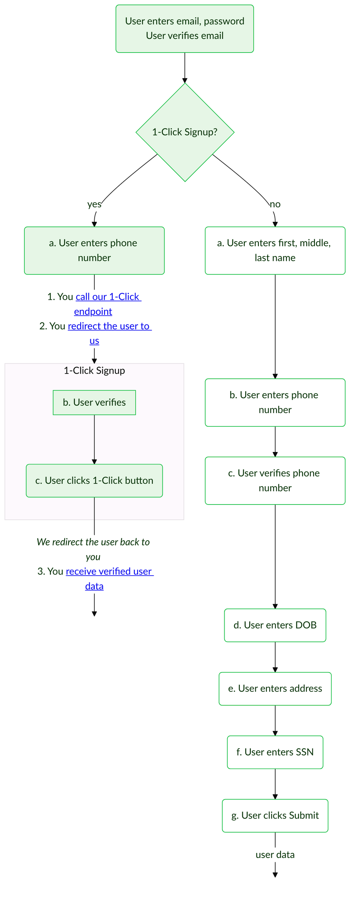
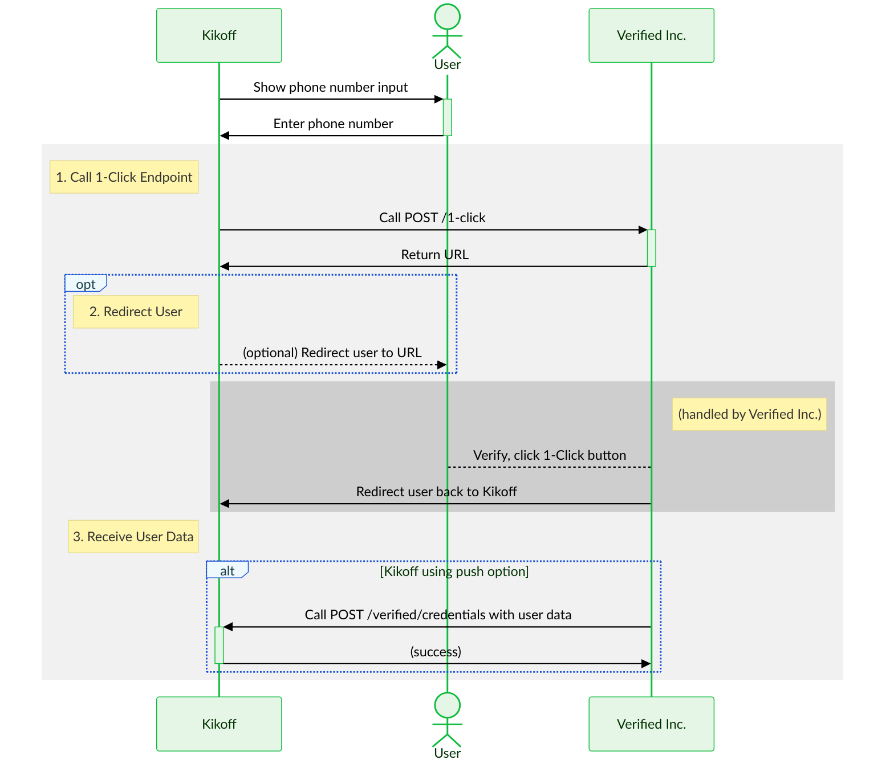

import TooltipWithDefaults from '../src/components/TooltipWithDefaults';
import Tip from '../src/components/Tip';
import Tabs from '@theme/Tabs';
import TabItem from '@theme/TabItem';
import TestingCredentialsSnippet from './reusables/sandbox-testing-credentials.mdx';
import Admonition from '@theme/Admonition';

- **Time to read:** 15 minutes
- **Time to implement:** 2-4 hours

{/* :::tip[✅ 1-Hour Guarantee]
We are _obsessed_ with making it as easy as possible for you to implement 1-Click Signup.
- If it takes you more than 1 hour to implement, we'll send you a free Verified Inc. t-shirt! 
- If it takes you less than 1 hour, we'll send you a free t-shirt _and_ mug!
::: */}

---

**Dear Kikoff team:** We've created this custom guide to make implementation as easy as possible for you. It includes detailed recommendations and streamlined instructions to implement those recommendations. For general information about 1-Click Signup, and for all of the available implementation options, please see our main [1-Click Signup docs](/1-click-signup). Let us know if you have any questions!

_This guide is only accessible via direct URL: https://docs.verified.inc/kikoff-guide_.

---

:::note[Kikoff Brand Info]
We've set the following details for the Kikoff brand. Please let us know if you'd like to change any of these.

| Attribute | Value | Description |
|:----------|:------| :---------- |
| Logo |  | Your logo icon |
| Home Page URL | https://kikoff.com | Your website |
| Terms URL | https://kikoff.com/terms.pdf | Your terms of service |
| Privacy URL | https://kikoff.com/privacy-policy.pdf | Your privacy policy |
| Default Redirect URL | https://kikoff.com | Default for where we'll redirect the user when they finish 1-Click Signup |

We've also set the default data types you'll request from users to match what you have in the existing Kikoff signup flow:
<details>
    <summary><b>Default Data Types Requested</b></summary>

    Note that:
    - The order of these types is the order the user will see the data fields when they're asked to signup. We matched the order of Kikoff's existing signup flow.
    - We ommitted email and phone, since you'll already have collected those. **We will pass back to you whether the user verified their phone — even if they opt out of sharing additional data — so you don't have to ask them to re-verify it.**
    - We set the `description`s to match what you have in your existing signup flow.
    - We set most of these to `"mandatory": "yes"`, which makes a field display as required to users. The only exceptions are `MiddleNameCredential` and `Line2Credential` (within `AddressCredential`), which are set to `"mandatory": "no"`, which makes a field display as optional.
    - We set all of these to `"allowUserInput": "true"`, which allows users to edit the data we source for them. This is helpful in case the data is outdated or (in rare cases) incorrect, but you can also disable it.

    | `type` <div style={{width:13+'rem'}}></div> | `mandatory` | `allowUserInput` | `description` |
    |:------ |:------------- |:-------------- |:------------- |
    | `FullNameCredential` | `yes` | `true` | None |
    | &#x21B3; `FirstNameCredential` | `yes` | `true` | None |
    | &#x21B3; `MiddleNameCredential` | `no` | `true` | `We use your full legal name to update your credit report.` |
    | &#x21B3; `LastNameCredential` | `yes` | `true` | None |
    | `BirthDateCredential` | `yes` | `true` | `To wish you a happy birthday! We also use this to match your credit identity and to verify your age in compliance with federal law.` |
    | `AddressCredential` | `yes` | `true` | `We use this to verify your identity and for when we report your positive payments to the credit bureau(s).` |
    | &#x21B3; `Line1Credential` | `yes` | `true` | `No P.O. boxes` |
    | &#x21B3; `Line2Credential` | `no` | `true` | `Apt/Suite number (optional)` |
    | &#x21B3; `CityCredential` | `yes` | `true` | None |
    | &#x21B3; `StateCredential` | `yes` | `true` | None |
    | &#x21B3; `ZipCodeCredential` | `yes` | `true` | None |
    | &#x21B3; `CountryCredential` | `yes` | `true` | None |
    | `SsnCredential` | `yes` | `true` | `We match your SSN to your credit bureau records and make sure we’re updating the right person’s file. We use bank-level security to keep you and your data safe.` |
</details>
:::


## Recommendations for Kikoff

To implement 1-Click Signup, there are a few decisions to make:
- [**Where to Start the Flow**](#where-to-start-the-flow)
- [**Whether to Redirect the User**](#whether-to-redirect-the-user)
- [**How to Receive User Data**](#how-to-receive-user-data)

We've done a thorough review of Kikoff's existing signup flow and included our recommendations below.


### Where to Start the Flow

**We recommend starting the flow right after the user has verified their email.**

- This will allow you to keep your existing account creation step unchanged. The user can enter an email and password and then verify their email like usual, and then they can start 1-Click Signup.
- Currently, after the user verifies their email, you ask the user first for their name (and then for phone, phone verification, DOB, address, and SSN).
- We recommend that you ask the user first for their phone number, since we can pull verified name as part of 1-Click Signup.


### Whether to Redirect the User

**We recommend redirecting the user.**

- It's an optional step to redirect the user to the URL our `/1-click` endpoint returns.
- In your case, we think it's best that you do this step because it ensures the user stays on the device they started on, even if they're using a non-mobile device.
- To make this clearer:
    - Suppose a user starts signing up for Kikoff on a laptop.
    - If you call `/1-click` but do _not_ redirect the user to the URL it returns, the user will have to verify via a link in the SMS we send them. (The link is the only way for the user to end up on our share data screen.)
    - In many cases, the SMS go to their phone, so when they click the link the user will end up on their phone.
- If you _want_ to push users to their phones, for example to make it easier to prompt them to install the Kikoff mobile app, then not redirecting users would make a lot of sense. So it depends what you're trying to achieve.
- See our main 1-Click Signup docs for a full list of [pros and cons](/1-click-signup#pros-and-cons) of redirecting the user.


### How to Receive User Data

**We recommend using the push option.**

- We offer 2 options for receiving user data:
    1. With the push option, we hit an endpoint you provide with user data.
    2. With the pull option, you hit our endpoint to retrieve user data.
- Conversion is 100% with the push option because we can send you data the moment the user agrees to share.
- Conversion tends to be a bit less than 100% with the pull option because there's a time delay between when the user agrees to share and when you can call our API to retrieve data. (We redirect the user back to you, and you use a URL param value to call our API. This is fast, but it leaves a window in which the user can abandon the flow.)
- Therefore, we recommend the push option.

:::info[This Guide Only Shows the Recommended Implementation]
The rest of this guide only includes info relevant to our recommended implementation, so it's easy for you to consume. If you'd like to use a different implementation, don't hesitate to let us know — we'll be happy to update this guide. And you can always refer to our main [1-Click Signup docs](/1-click-signup) for information on all available options for implementation.
:::


## User Experience

The current Kikoff signup flow UX is:

<ol type="a">
    <li>User enters first, middle, last name</li>
    <li>User enters phone number</li>
    <li>User verifies phone number</li>
    <li>User enters DOB</li>
    <li>User enters address</li>
    <li>User enters SSN</li>
    <li>User clicks Submit</li>
</ol>

With 1-Click Signup, it will be:

<ol type="a">
    <li>User enters phone number</li>
    <li>User verifies</li>
    <li>User clicks 1-Click button</li>
</ol>


### Demos

The easiest way to get a feel for the user experience is to try our demos. Since we're recommending that you redirect users (see [Whether to Redirect the User](#whether-to-redirect-the-user)), we've only included demos showing that flow here. For the full selection of demos, see our [1-Click Signup Demos](/demo-1-click-signup) page.

:::tip[Text "CREDIT" to +1 (202) 831-7415]
The demos below are a great way to see the overall user experience, but they don't show Kikoff's actual 1-Click Signup page in action. To make it easier for you to see this page, we enabled a Text to Signup flow with "CREDIT" as the keyword. 

Just [text "CREDIT" to +1 (202) 831-7415](sms:+12028317415&body=CREDIT). Click that link or scan the QR code below to pull up a draft SMS.

:::

<Tabs>
    <TabItem value="static" label="Static" default>
        <Admonition type="note">
            **This demo, because it's static, doesn't _exactly_ match our recommended implementation.** (Specifically, the data types requested in this demo are slightly different than the ones we have set for your brand.) However, it's very close: the core user experience is the same.
        </Admonition>
        <iframe
            src='https://marvelapp.com/prototype/1aab8g0e/?emb=1&iosapp=false&frameless=false'
            width='453'
            height='864'
            allowTransparency='true'
            frameborder='0'
        ></iframe>
    </TabItem>
    <TabItem value="live-sandbox" label="Live: Sandbox">
        <Admonition type="tip" title="Sandbox Testing">
            **We recommend that you test using your own phone number.** This will allow you to receive SMS messages, which are necessary to test the full 1-Click Signup flow (but won't work for the test user). Using your own phone number in sandbox, you'll receive dummy user data.
            <details>
                <summary><b>Supported Phone Numbers</b></summary>

                Currently, only US phone numbers work with 1-Click Signup (and we're able to source verified data for 95% of these numbers).
            </details>
            Since this flow we're recommending involves redirecting the user, it only requires entering a verification code. That means you can also use our test user's phone number (for which there is a dummy verification code) instead of your own phone number:
            <details>
                <summary><b>Test User Login Credentials</b></summary>

                ```text title="Phone"
                +10123456789
                ```
                ```text title="Email"
                richard@piedpiper.net
                ```
                ```text title="Verification Code"
                111111
                ```
            </details>
        </Admonition>
        <iframe
            src='https://kredita-1click-web.demo.sandbox-verifiedinc.com?redirect=true'
            width='453'
            height='864'
        ></iframe>
        <div>
            <a href='https://kredita-1click-web.demo.sandbox-verifiedinc.com?redirect=true' target='_blank'>Open Demo in New Tab ↗</a>
        </div>
        <div>
            <a href='https://github.com/VerifiedInc/Kredita-Demo-Web' target='_blank'>View Source Code on GitHub ↗</a>
        </div>
    </TabItem>
    <TabItem value="live-production" label="Live: Production">
        <Admonition type="tip" title="Production Usage">
            **In production, you need to use own phone number.** The verified data we return will be your data!
            <details>
                <summary><b>Supported Phone Numbers</b></summary>

                Currently, only US phone numbers work with 1-Click Signup (and we're able to source verified data for 95% of these numbers).
            </details>
            If your phone number doesn't work with 1-Click Signup in production (and your phone number is a US number), that means it's in the 5% of US numbers we can't source verified data for. However, you can still manually input data to complete the flow.
        </Admonition>
        <iframe
            src='https://kredita-1click-web.demo.verified.inc?redirect=true'
            width='453'
            height='864'
        ></iframe>
        <div>
            <a href='https://kredita-1click-web.demo.verified.inc?redirect=true' target='_blank'>Open Demo in New Tab ↗</a>
        </div>
        <div>
            <a href='https://github.com/VerifiedInc/Kredita-Demo-Web' target='_blank'>View Source Code on GitHub ↗</a>
        </div>
    </TabItem>
</Tabs>


### Flow Diagram

Here's the user experience, using our recommended implementation for Kikoff:




### Sequence Diagram

Here's how this works, using our recommended implementation for Kikoff:




## Recommended Implementation

:::tip[Sandbox Testing]
**To test 1-Click Signup in our sandbox environment, you can use your Kikoff sandbox API key,** which we've shared with your team directly.

**We recommend that you test using your own phone number.** This will allow you to receive SMS messages, which are necessary to test the full 1-Click Signup flow. Using your own phone number in sandbox, you'll receive random dummy user data.
<details>
    <summary><b>Phone Number Format</b></summary>

    Make sure to use a 10-digit string, with the `+1` country code at the beginning:
    ```text title="Phone"
    +10123456789
    ```
    Currently, only US phone numbers work with 1-Click Signup (and we're able to source verified data for 95% of these numbers).
</details>

You can also use our test user, but note that you won't be able to receive SMS messages for this user.
<details>
    <summary><b>Test User Login Credentials</b></summary>

    ```text title="Phone"
    +10123456789
    ```
    ```text title="Email"
    richard@piedpiper.net
    ```
    ```text title="Verification Code"
    111111
    ```
    Yes, this is Richard Hendricks from [_Silicon Valley_](https://en.wikipedia.org/wiki/Silicon_Valley_(TV_series))! 😂
</details>
:::


### 3 Steps to Implement

As you can see in the [flow diagram](#flow-diagram) and [sequence diagram](#sequence-diagram) above, you have 3 steps to implement for 1-Click Signup:
1. [**Call 1-Click endpoint**](#call-1-click-endpoint)
2. [**Redirect user**](#redirect-user)
3. [**Receive user data**](#receive-user-data)

We've included instructions and recommendations for each of these steps below.


### 1. Call 1-Click Endpoint {#call-1-click-endpoint}

The 1-Click endpoint is [`POST /1-click`](/api-overview#1-click). Call it to begin 1-Click Signup.

#### Request

**We recommend that you use the following request body:**
```typescript title="POST /1-click Request Body: Recommendation for Kikoff"
{
    "phone": string, // 10-digit string with +1 country code at the beginning
    "email": string,
    "verificationOptions": "only_code", // optimizes for redirect flow
}
```

:::note[Why this request body?]
- `phone` and `email` allow us to source verified data about the user and send it to you
- `"verificationOptions": "only_code"` optimizes for the redirect flow we're recommending to you. You can also use `"verificationOptions": "both_link_and_code"` if you want the SMS the user receives to have a verification link as a backup option. 
:::

:::tip[Further Customization]
Some other options that might be relevant for Kikoff:
- `"content": {"title": "Apply"}`: Use this if you want the language to be "1-Click Apply" instead of "1-Click Signup". This might be helpful in your case, since you have users first create accounts with just email and password. You can also use `"content": {"title": "Verify"}` if you prefer "1-Click Verify".
- `"redirectUrl": string`: Use this if you want to set a different redirect URL for a particular 1-Click Signup flow. (This redirect URL is where will we redirect the user to when they complete 1-Click Signup.) For example, if you want us to redirect the user to a different URL if they start on desktop, you could pass this attribute to `/1-click` when the user is on desktop.
:::


#### Response

If 1-Click Signup is possible for the phone number included in the request body, the response body will contain a URL:

```typescript title="POST /1-click Response Body"
{
    "url": "https://wallet.verified.inc/request/9f2053fc-cc4c-41cb-8d14-7d3ccf6167eb"
}
```

If 1-Click Signup is _not_ possible, the response body will be empty or contain an error.


### 2. Redirect User {#redirect-user}

**We recommend that you redirect the user to the `url` returned by `/1-click`.**

As noted above, this is an optional step, but we think it makes sense for you to do, given the nature of Kikoff's product. (But of course, it's up to you!) See [Whether to Redirect the User](#whether-to-redirect-the-user) for more information.


### 3. Receive User Data {#receive-user-data}

**We recommend that you use the push option to retrieve user data.** The push option involves us hitting an endpoint you provide.

As noted above, there is also a pull option, which involves you hitting our endpoint. But conversion tends to be a bit less than 100% for the pull option, so we think the push option is better for Kikoff. See [How to Receive User Data](#how-to-receive-user-data) for more information.

All you need to do is create a webhook called `POST /verified/credentials` according to our [OpenAPI spec](https://gist.github.com/VerifiedIncMachine/ef399f6b5ce6545eb4d7ec3e85d87dd2). This is where we will send verified user data when a user consents to share it.

**By default, you will receive a simplified set of user data,** so it's easy for you to take further action based on it (like creating a new account for the user). This simplified set only contains user data. But you can also choose to receive an encriched set — just ask us to enable it for you — which contains much more metadata. 

:::tip
One particularly valuable piece of metadata is **`verificationMethod`**, which describes how the credential (piece of user data) was verified. It can take the following values:
- `"phone_carrier"`: verified via phone carrier records
- `"otp"`: verified via an OTP (one time passcode)
- `"self_attested"`: attested by the user themselves (not verified)
- `null`
:::

<Tabs>
  <TabItem value="simplified" label="Simplified" default>
    ```typescript title="Data the User Shared"
    {
        "fullName": {
            "firstName": "Richard", 
            "lastName": "Hendricks"
        },
        "email": "richard@piedpiper.net",
        "phone": "+10123456789",
        "address": {
            "line1": "5320 Newell Rd",
            "line2": "",
            "city": "Palo Alto",
            "state": "CA",
            "zip": "94303",
            "country": "US"
        },
        "ssn": "123456789",
        "birthDate": "617947200000" // Unix timestamp in ms
    }
    ```
    </TabItem>
    <TabItem value="enriched" label="Enriched">
        ```typescript title="Data the User Shared"
        {
            "uuid": "1788d86d-5753-42e5-896e-44266cbfad8c", // the sharedCredentialsUuid
            "phone": "+10123456789",
            "credentials": [
                {
                    "id": "1be7c008-3f0c-4a21-9aad-69ca1c4251d2",
                    "issuerUuid": "c3be0124-8f03-4983-baef-3302e0be88f4",
                    "issuanceDate": "1671847264479",
                    "expirationDate": "1871839024044",
                    "type": "FullNameCredential",
                    "status": "valid",
                    "verificationMethod": "phone_carrier",
                    "data": [
                        {
                            "id": "2e6a7b9a-e93e-43ba-98a9-c554f4e16457",
                            "issuerUuid": "c3be0124-8f03-4983-baef-3302e0be88f4",
                            "issuanceDate": "1671847264479",
                            "expirationDate": "1871839024044",
                            "type": "FirstNameCredential",
                            "status": "valid",
                            "verificationMethod": "phone_carrier",
                            "data": {
                                "firstName": "Richard"
                            }
                        },
                        {
                            "id": "9a5817ef-e621-4277-8c48-c8ee3776b6c4",
                            "issuerUuid": "c3be0124-8f03-4983-baef-3302e0be88f4",
                            "issuanceDate": "1671847264479",
                            "expirationDate": "1871839024044",
                            "type": "LastNameCredential",
                            "status": "valid",
                            "verificationMethod": "phone_carrier",
                            "data": {
                                "lastName": "Hendricks"
                            }
                        }
                    ]
                },
                {
                    "id": "8a1d4e35-413d-496b-b499-8810b55cfb5c",
                    "issuerUuid": "c3be0124-8f03-4983-baef-3302e0be88f4",
                    "issuanceDate": "1671847264479",
                    "expirationDate": "1871839024044",
                    "type": "EmailCredential",
                    "status": "valid",
                    "verificationMethod": "phone_carrier",
                    "data": {
                        "email": "richard@piedpiper.net"
                    }
                },
                {
                    "id": "80e07f16-999b-4402-aa0f-96f650b72fec",
                    "issuerUuid": "c3be0124-8f03-4983-baef-3302e0be88f4",
                    "issuanceDate": "1671847264479",
                    "expirationDate": "1871839024044",
                    "type": "PhoneCredential",
                    "status": "valid",
                    "verificationMethod": "phone_carrier",
                    "data": {
                        "phone": "+10123456789"
                    }
                },
                {
                    "id": "5f502836-ea9b-4032-89d5-19ac1c6ca3d7",
                    "issuerUuid": "c3be0124-8f03-4983-baef-3302e0be88f4",
                    "issuanceDate": "1671847264479",
                    "expirationDate": "1871839024044",
                    "type": "AddressCredential",
                    "status": "valid",
                    "verificationMethod": "phone_carrier",
                    "data": [
                        {
                            "id": "f5a4dc93-bc06-4bb8-bd05-17b5ba912bcd",
                            "issuerUuid": "c3be0124-8f03-4983-baef-3302e0be88f4",
                            "issuanceDate": "1671847264479",
                            "expirationDate": "1871839024044",
                            "type": "Line1Credential",
                            "status": "valid",
                            "verificationMethod": "phone_carrier",
                            "data": {
                                "line1": "5320 Newell Rd"
                            }
                        },
                        {
                            "id": "b58910a4-b95e-461d-a68e-387c29440c12",
                            "issuerUuid": "c3be0124-8f03-4983-baef-3302e0be88f4",
                            "issuanceDate": "1671847264479",
                            "expirationDate": "1871839024044",
                            "type": "Line2Credential",
                            "status": "valid",
                            "verificationMethod": "phone_carrier",
                            "data": {
                                "line2": ""
                            }
                        },
                        {
                            "id": "efd3820f-676a-4db1-b63e-695b66ed8ba0",
                            "issuerUuid": "c3be0124-8f03-4983-baef-3302e0be88f4",
                            "issuanceDate": "1671847264479",
                            "expirationDate": "1871839024044",
                            "type": "CityCredential",
                            "status": "valid",
                            "verificationMethod": "phone_carrier",
                            "data": {
                                "city": "Palo Alto"
                            }
                        },
                        {
                            "id": "b65022a2-2016-41df-88f3-252e8e3a29c5",
                            "issuerUuid": "c3be0124-8f03-4983-baef-3302e0be88f4",
                            "issuanceDate": "1671847264479",
                            "expirationDate": "1871839024044",
                            "type": "StateCredential",
                            "status": "valid",
                            "verificationMethod": "phone_carrier",
                            "data": {
                                "state": "CA"
                            }
                        },
                        {
                            "id": "b747ff84-39d8-4df9-98f9-24a465f1a9ae",
                            "issuerUuid": "c3be0124-8f03-4983-baef-3302e0be88f4",
                            "issuanceDate": "1671847264479",
                            "expirationDate": "1871839024044",
                            "type": "ZipCodeCredential",
                            "status": "valid",
                            "verificationMethod": "phone_carrier",
                            "data": {
                                "zipCode": "94303"
                            }
                        },
                        {
                            "id": "d57a7bca-2a7c-4671-86ad-5647731cad02",
                            "issuerUuid": "c3be0124-8f03-4983-baef-3302e0be88f4",
                            "issuanceDate": "1671847264479",
                            "expirationDate": "1871839024044",
                            "type": "CountryCredential",
                            "status": "valid",
                            "verificationMethod": "phone_carrier",
                            "data": {
                                "country": "US"
                            }
                        }
                    ]
                },
                {
                    "id": "ec1ef0ce-eeed-46a4-94a9-29b46e64403d",
                    "issuerUuid": "c3be0124-8f03-4983-baef-3302e0be88f4",
                    "issuanceDate": "1671847264479",
                    "expirationDate": "1871839024044",
                    "type": "SsnCredential",
                    "status": "valid",
                    "verificationMethod": "phone_carrier",
                    "data": {
                        "ssn": "111223333"
                    }
                },
                {
                    "id": "ec1ef0ce-eeed-46a4-94a9-29b46e64403d",
                    "issuerUuid": "c3be0124-8f03-4983-baef-3302e0be88f4",
                    "issuanceDate": "1671847264479",
                    "expirationDate": "1871839024044",
                    "type": "BirthDateCredential",
                    "status": "valid",
                    "verificationMethod": "phone_carrier",
                    "data": {
                        "birthDate": "617947200000" // Unix timestamp in ms
                    }
                }
            ]
        }
        ```
    </TabItem>
</Tabs>