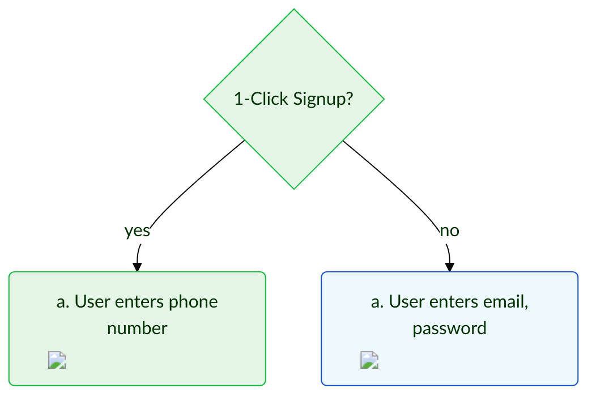
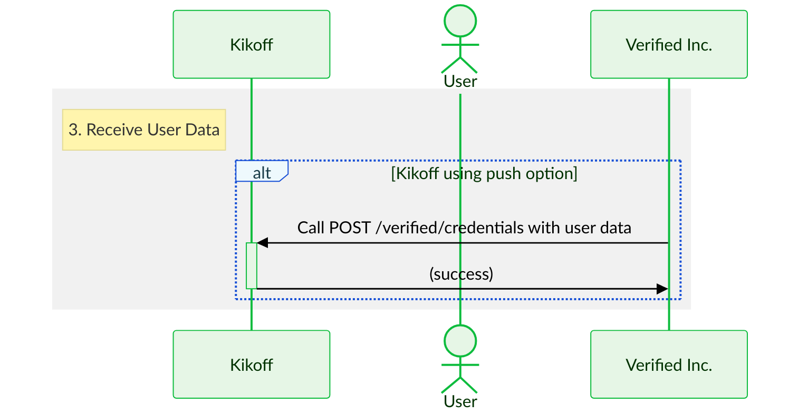
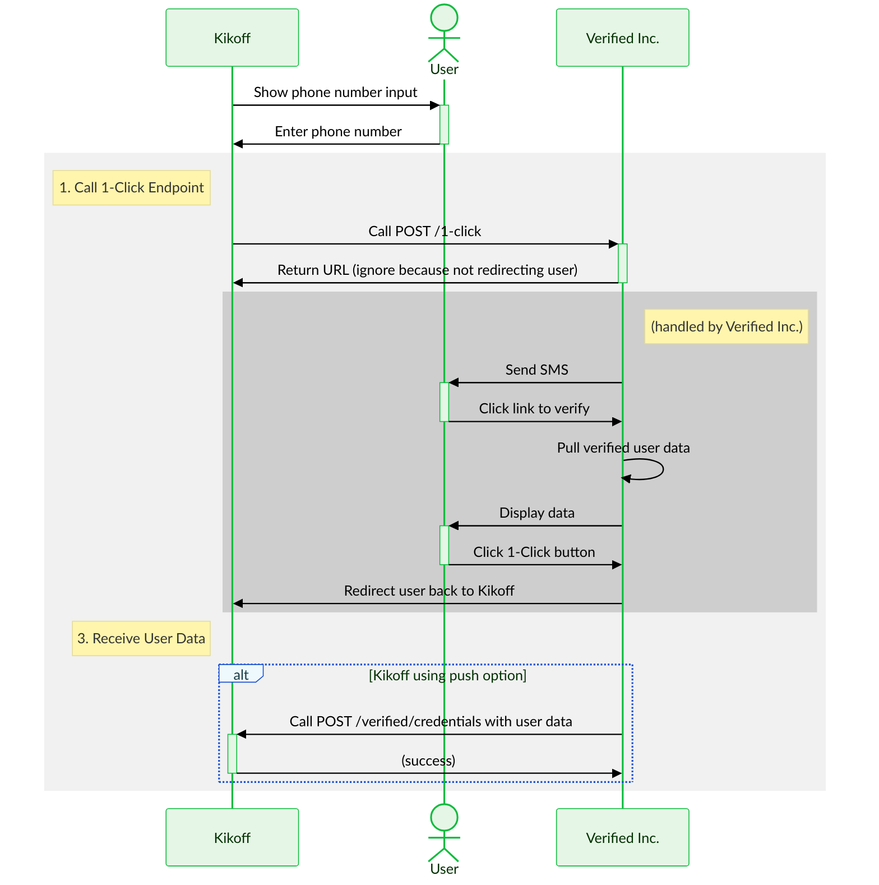
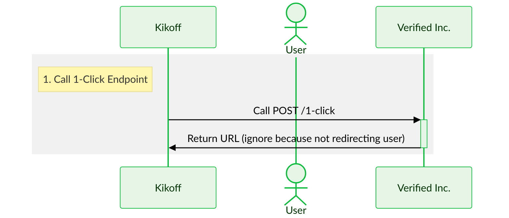

import TooltipWithDefaults from '../src/components/TooltipWithDefaults';
import Tip from '../src/components/Tip';
import Tabs from '@theme/Tabs';
import TabItem from '@theme/TabItem';
import TestingCredentialsSnippet from './reusables/sandbox-testing-credentials.mdx';
import Admonition from '@theme/Admonition';

- **Time to read:** 15 minutes
- **Time to implement:** 2-4 hours

{/* :::tip[✅ 1-Hour Guarantee]
We are _obsessed_ with making it as easy as possible for you to implement 1-Click Signup.
- If it takes you more than 1 hour to implement, we'll send you a free Verified Inc. t-shirt! 
- If it takes you less than 1 hour, we'll send you a free t-shirt _and_ mug!
::: */}

---

**Kikoff team:** We've created this custom guide to make implementation as easy as possible for you. It includes detailed recommendations and streamlined instructions to implement those recommendations. For general information about 1-Click Signup, and for all of the available implementation options, please see our main [1-Click Signup docs](/). Let us know if you have any questions!

_This guide is only accessible via direct URL: https://docs.verified.inc/kikoff-guide_.

---

:::note[Kikoff Brand Info]
We've set the following details for the Kikoff brand. Please let us know if you'd like to change any of these.

| Attribute | Value | Description |
|:----------|:------| :---------- |
| Logo |  | Your logo icon |
| Home Page URL | https://kikoff.com | Your website |
| Terms URL | https://kikoff.com/terms.pdf | Your terms of service |
| Privacy URL | https://kikoff.com/privacy-policy.pdf | Your privacy policy |
| Default Redirect URL | https://kikoff.com | Default for where we'll redirect the user when they finish 1-Click Signup |

We've also set the default data types you'll request from users to match what you have in the existing Kikoff signup flow:
<details>
    <summary><b>Default Data Types Requested</b></summary>

    Note that:
    - The order of these types is the order the user will see the data fields when they're asked to signup. We matched the order of Kikoff's existing signup flow.
    - We omitted phone, since you'll already have collected that. **We will pass back to you whether the user verified their phone — even if they opt out of sharing additional data — so you don't have to ask them to re-verify it.**
    - We set the `description`s to match what you have in your existing signup flow.
    - We set most of these to `"mandatory": "yes"`, which makes a field display as required to users. The only exceptions are `MiddleNameCredential` and `Line2Credential` (within `AddressCredential`), which are set to `"mandatory": "no"`, which makes a field display as optional.
    - We set all of these to `"allowUserInput": "true"`, which allows users to edit the data we source for them. This is helpful in case the data is outdated or (in rare cases) incorrect, but you can also disable it.

    | `type` <div style={{width:13+'rem'}}></div> | `mandatory` | `allowUserInput` | `description` |
    |:------ |:------------- |:-------------- |:------------- |
    | `EmailCredential` | `yes` | `true` | None |
    | `FullNameCredential` | `yes` | `true` | `We use your full legal name to update your credit report.` |
    | &#x21B3; `FirstNameCredential` | `yes` | `true` | None |
    | &#x21B3; `MiddleNameCredential` | `no` | `true` | None |
    | &#x21B3; `LastNameCredential` | `yes` | `true` | None |
    | `BirthDateCredential` | `yes` | `true` | `To wish you a happy birthday! We also use this to match your credit identity and to verify your age in compliance with federal law.` |
    | `AddressCredential` | `yes` | `true` | `We use this to verify your identity and for when we report your positive payments to the credit bureau(s).` |
    | &#x21B3; `Line1Credential` | `yes` | `true` | `No P.O. boxes` |
    | &#x21B3; `Line2Credential` | `no` | `true` | `Apt/Suite number (optional)` |
    | &#x21B3; `CityCredential` | `yes` | `true` | None |
    | &#x21B3; `StateCredential` | `yes` | `true` | None |
    | &#x21B3; `ZipCodeCredential` | `yes` | `true` | None |
    | &#x21B3; `CountryCredential` | `yes` | `true` | None |
    | `SsnCredential` | `yes` | `true` | `We match your SSN to your credit bureau records and make sure we’re updating the right person’s file. We use bank-level security to keep you and your data safe.` |
</details>
:::


## Recommendations for Kikoff

To implement 1-Click Signup, there are a few decisions to make:
- [**Where to Start the Flow**](#where-to-start-the-flow)
- [**Whether to Redirect the User**](#whether-to-redirect-the-user)
- [**How to Receive User Data**](#how-to-receive-user-data)

We've done a thorough review of Kikoff's existing signup flow and included our recommendations below.


### Where to Start the Flow

**We recommend starting the flow at the very beginning — replacing your email and password inputs with a phone input.**

- This will result in the fastest signup experience . The user will enter and verify their phone number, and then click a button to share verified email, name, DOB, address, and SSN all at once. It'll take just 15-30 seconds.
- After this, you can have the user verify their email if necessary, set a password, or enter payment info.
- You'll often be able to skip the email verification step, if the email is verified and the user doesn't edit it.

To make this visual, here's a sample of the full [flow diagram](#flow-diagram) included later:



{/* **We recommend starting the flow right after the user has verified their email.**

- This will allow you to keep your existing account creation step unchanged. The user can enter an email and password and then verify their email like usual, and then they can start 1-Click Signup.
- Currently, after the user verifies their email, you first ask the user for their name (and then for phone, phone verification, DOB, address, and SSN).
- We recommend that you **first ask the user for their phone number,** since we can pull verified name as part of 1-Click Signup. */}


### Whether to Redirect the User

**We recommend NOT redirecting the user.**

- It's an optional step to redirect the user to the URL our `/1-click` endpoint returns. This prompts the user to enter a verification code from an SMS.
- If you don't redirect the user, the user instead clicks a verification link in the SMS. This is the fastest experience, and it tends to take users to their mobile device, which is helpful in Kikoff's case because it makes it easier for you to prompt the user to install your mobile app.
- Not redirecting the user is also an easier implementation: you can skip a step.
- See our main 1-Click Signup docs for a full list of [pros and cons](/#pros-and-cons) of redirecting the user versus not.

Here's a sample of the full [flow diagram](#flow-diagram) included later that shows how slick the flow is when you don't redirect the user:

```mermaid
%%{
    init: {
        'theme': 'base',
        'themeVariables': {
            'primaryColor': '#e6f6e6',
            'primaryTextColor': '#003100',
            'primaryBorderColor': '#0dbc3d',
            'secondaryColor': '#eef9fd',
            'secondaryTextColor': '#193c47',
            'secondaryBorderColor': '#164fd6',
            'edgeLabelBackground': '#ffffff',
            'textColor': '#000000',
            'fontFamily': 'Lato'
        }
    }
}%%
flowchart LR
    B(<span style="max-width: 10rem; white-space: normal;">a. User enters phone number</span><span><img style="max-width: 10rem; min-width: 10rem; margin: 0 auto; margin-top: 0.5rem;" src="/img/kikoff/1-Click Signup - Phone.png"/></span>)
    B --> C(<span style="max-width: 10rem; white-space: normal;">b. User verifies with SMS link</span><span><img style="max-width: 10rem; min-width: 10rem; margin: 0 auto; margin-top: 0.5rem;" src="/img/kikoff/1-Click Signup - Verify Phone.png"/></span>)
    C --> G(<span style="max-width: 10rem; white-space: normal;">c. User clicks 1-Click button</span><span><img style="max-width: 10rem; min-width: 10rem; margin: 0 auto; margin-top: 0.5rem;" src="/img/kikoff/1-Click Signup - Data.png"/></span>)
    G -->|verified user data| E(<b>Kikoff</b>)

    style E fill-opacity:0, stroke-opacity:0;
```



{/* **We recommend redirecting the user.**

- It's an optional step to redirect the user to the URL our `/1-click` endpoint returns. This takes the user to a page we host, where they're prompted to enter a verification code. (If you don't redirect the user, they'll still end up on a page we host, but they'll click a verification link in the SMS instead.)
- In your case, we think it's best that you do this step because it ensures the user stays on the device they started on, even if they're using a non-mobile device.
- To clarify:
    - Suppose a user starts signing up for Kikoff on a laptop.
    - If you call `/1-click` but do _not_ redirect the user to the URL it returns, the user will have to verify via a link in the SMS we send them. (The link is the only way for the user to end up on our share data screen.)
    - In many cases, the SMS go to their phone, so when they click the link the user will end up on their phone.
- If you _want_ to push users to their phones, for example to make it easier to prompt them to install the Kikoff mobile app, then not redirecting users would make a lot of sense. So it depends what you're trying to achieve.
- See our main 1-Click Signup docs for a full list of [pros and cons](/#pros-and-cons) of redirecting the user. */}


### How to Receive User Data

**We recommend using the push option.**

- We offer 2 options for receiving user data:
    1. **Push option:** _We push data to you,_ by hitting an endpoint you provide.
    2. **Pull option:** _You pull data from us,_ by hiting and endpoint we provide.
- Conversion is 100% with the push option because we can send you data the moment the user agrees to share.
- Conversion tends to be a bit less than 100% with the pull option because there's a time delay between when the user agrees to share and when you can call our API to retrieve data. (We redirect the user back to you, and you use a URL param value to call our API. This is fast, but it leaves a window in which the user can abandon the flow.)
- Therefore, we recommend the push option.



:::info[This Guide Only Shows the Recommended Implementation]
The rest of this guide only includes info relevant to our recommended implementation, so it's easy for you to consume. If you'd like to use a different implementation, don't hesitate to let us know — we'll be happy to update this guide. And you can always refer to our main [1-Click Signup docs](/) for information on all available options for implementation.
:::


## User Experience

The current Kikoff signup flow is:

<ol type="a">
    <li>User enters email, password</li>
    <li>User verifies</li>
    <li>User enters first, middle, last name</li>
    <li>User enters phone number</li>
    <li>User verifies phone number with SMS OTP</li>
    <li>User enters DOB</li>
    <li>User enters address</li>
    <li>User enters SSN</li>
    <li>User clicks Submit</li>
</ol>

With 1-Click Signup, the flow will instead be:

<ol type="a">
    <li>User enters phone number</li>
    <li>User verifies with SMS link</li>
    <li>User clicks 1-Click button</li>
</ol>


### Flow Diagram

Here's the user experience, using our recommended implementation for Kikoff. You can view the flow with and without screenshots below.

<Tabs>
    <TabItem value="with-screenshots" label="With Screenshots" default>
        ```mermaid
        %%{
            init: {
                'theme': 'base',
                'themeVariables': {
                    'primaryColor': '#e6f6e6',
                    'primaryTextColor': '#003100',
                    'primaryBorderColor': '#0dbc3d',
                    'secondaryColor': '#eef9fd',
                    'secondaryTextColor': '#193c47',
                    'secondaryBorderColor': '#164fd6',
                    'edgeLabelBackground': '#ffffff',
                    'textColor': '#000000',
                    'fontFamily': 'Lato'
                }
            }
        }%%
        flowchart TD
            A{1-Click Signup?} -->|yes| B(<span style="max-width: 10rem; white-space: normal;">a. User enters phone number</span><span></span>)
            B -->|1. You <a href="#call-1-click-endpoint">call our 1-Click endpoint</a>| C(<span style="max-width: 10rem; white-space: normal;">b. User verifies with SMS link</span><span></span>)
            C --> G(<span style="max-width: 10rem; white-space: normal;">c. User clicks 1-Click button</span><span></span>)
            G -->|2. You <a href="#receive-user-data">receive verified user data</a>| H[ ] 
            A -->|no| J(<span style="max-width: 10rem; white-space: normal;">a. User enters email, password</span><span></span>)
            J --> K(<span style="max-width: 10rem; white-space: normal;">b. User verifies email</span><span></span>)
            K --> L(<span style="max-width: 10rem; white-space: normal;">c. User enters first, middle, last name</span><span></span>)
            L --> M(<span style="max-width: 10rem; white-space: normal;">d. User enters phone number</span><span></span>)
            M --> N(<span style="max-width: 10rem; white-space: normal;">e. User verifies phone number with SMS OTP</span><span></span>)
            N --> O(<span style="max-width: 10rem; white-space: normal;">f. User enters DOB</span><span></span>)
            O --> P(<span style="max-width: 10rem; white-space: normal;">g. User enters address</span><span></span>)
            P --> Q(<span style="max-width: 10rem; white-space: normal;">h. User enters SSN</span><span></span>)
            Q --> R(<span style="max-width: 10rem; white-space: normal;">i. User clicks Submit</span><span></span>)
            R -->|user data| S[ ]

            style H fill-opacity:0, stroke-opacity:0;
            style S fill-opacity:0, stroke-opacity:0;

            style J fill:#eef9fd, stroke:#164fd6;
            style K fill:#eef9fd, stroke:#164fd6;
            style L fill:#eef9fd, stroke:#164fd6;
            style M fill:#eef9fd, stroke:#164fd6;
            style N fill:#eef9fd, stroke:#164fd6;
            style O fill:#eef9fd, stroke:#164fd6;
            style P fill:#eef9fd, stroke:#164fd6;
            style Q fill:#eef9fd, stroke:#164fd6;
            style R fill:#eef9fd, stroke:#164fd6;
        ```
    </TabItem>
    <TabItem value="without-screenshots" label="Without Screenshots">
        ```mermaid
        %%{
            init: {
                'theme': 'base',
                'themeVariables': {
                    'primaryColor': '#e6f6e6',
                    'primaryTextColor': '#003100',
                    'primaryBorderColor': '#0dbc3d',
                    'secondaryColor': '#eef9fd',
                    'secondaryTextColor': '#193c47',
                    'secondaryBorderColor': '#164fd6',
                    'edgeLabelBackground': '#ffffff',
                    'textColor': '#000000',
                    'fontFamily': 'Lato'
                }
            }
        }%%
        flowchart TD
            A{1-Click Signup?} -->|yes| B(a. User enters phone number)
            B -->|1. You <a href="#call-1-click-endpoint">call our 1-Click endpoint</a>| C(b. User verifies) --> G(c. User clicks 1-Click button)
            G -->|2. You <a href="#receive-user-data">receive verified user data</a>| H[ ] 
            A -->|no| J(a. User enters email, password)
            J --> K(b. User verifies email)
            K --> L(c. User enters first, middle, last name)
            L --> M(d. User enters phone number)
            M --> N(e. User verifies phone number)
            N --> O(f. User enters DOB)
            O --> P(g. User enters address)
            P --> Q(h. User enters SSN)
            Q --> R(i. User clicks Submit)
            R -->|user data| S[ ]

            style H fill-opacity:0, stroke-opacity:0;
            style S fill-opacity:0, stroke-opacity:0;

            style J fill:#eef9fd, stroke:#164fd6;
            style K fill:#eef9fd, stroke:#164fd6;
            style L fill:#eef9fd, stroke:#164fd6;
            style M fill:#eef9fd, stroke:#164fd6;
            style N fill:#eef9fd, stroke:#164fd6;
            style O fill:#eef9fd, stroke:#164fd6;
            style P fill:#eef9fd, stroke:#164fd6;
            style Q fill:#eef9fd, stroke:#164fd6;
            style R fill:#eef9fd, stroke:#164fd6;
        ```
    </TabItem>
</Tabs>

{/* ```mermaid
%%{
    init: {
        'theme': 'base',
        'themeVariables': {
            'primaryColor': '#e6f6e6',
            'primaryTextColor': '#003100',
            'primaryBorderColor': '#0dbc3d',
            'secondaryColor': '#eef9fd',
            'secondaryTextColor': '#193c47',
            'secondaryBorderColor': '#164fd6',
            'edgeLabelBackground': '#ffffff',
            'textColor': '#000000',
            'fontFamily': 'Lato'
        }
    }
}%%
flowchart TD
    A("User enters email, password \n User verifies email") --> B{1-Click Signup?}
    B -->|yes| C(a. User enters phone number)
    C -->|1. You <a href="#call-1-click-endpoint">call our 1-Click endpoint</a> \n 2. You <a href="#redirect-user">redirect the user to us</a>| 1-click-signup
    subgraph 1-click-signup [1-Click Signup]
        subgraph user-verifies[b. User verifies]
        end
        user-verifies --> H(c. User clicks 1-Click button)
    end
    H -->|<i>We redirect the user back to you</i> \n 3. You <a href="#receive-user-data">receive verified user data</a>| J[ ] 
    B -->|no| K(a. User enters first, middle, last name)
    K --> L(b. User enters phone number)
    L --> M(c. User verifies phone number)
    M --> N(d. User enters DOB)
    N --> O(e. User enters address)
    O --> P(f. User enters SSN)
    P --> Q(g. User clicks Submit)
    Q -->|user data| R[ ]

    style J fill-opacity:0, stroke-opacity:0;
    style R fill-opacity:0, stroke-opacity:0;

    style K fill-opacity:0;
    style L fill-opacity:0;
    style M fill-opacity:0;
    style N fill-opacity:0;
    style O fill-opacity:0;
    style P fill-opacity:0;
    style Q fill-opacity:0;
``` */}


### Demos

The easiest way to get a feel for the user experience is to try our demos, which use an example brand called Kredita. Using these demos, you'll 1-Click Signup for Kredita.

Since we're recommending that you do _not_ redirect users (see [Whether to Redirect the User](#whether-to-redirect-the-user)), we've only included demos showing that "without redirect" flow here. For the full selection of demos, see our [1-Click Signup Demos](/demo-1-click-signup) page.

:::note[Text "CREDIT" to +1 (505) 591-0362]
The demos below are a great way to see the overall user experience, but they don't show Kikoff's actual 1-Click Signup page in action. To make it easier for you to see this page, we've enabled a Text to Signup flow in sandbox with "CREDIT" as the keyword. 

Just [text "CREDIT" to +1 (505) 591-0362](sms:+15055910362&body=CREDIT). Click that link or scan the QR code below to pull up a draft SMS.

:::

<Tabs>
    <TabItem value="sandbox" label="Sandbox" default>
        <Admonition type="tip" title="Sandbox Testing">
            **We recommend that you test using your own phone number.** This will allow you to receive SMS messages, which are necessary to test the full 1-Click Signup flow (but won't work for the test user). Using your own phone number in sandbox, you'll receive dummy user data.
            <details>
                <summary><b>Supported Phone Numbers</b></summary>

                Currently, only US phone numbers work with 1-Click Signup (and we're able to source verified data for 95% of these numbers).
            </details>
        </Admonition>
        <p>
            Try the demo in the iframe below, or open it by scanning the QR code or clicking the link below:
            
        </p>
        <div>
            <a href='https://kredita-1click-web.demo.sandbox-verifiedinc.com' target='_blank'>Open Demo in New Tab ↗</a>
        </div>
        <div>
            <a href='https://github.com/VerifiedInc/Kredita-Demo-Web' target='_blank'>View Source Code on GitHub ↗</a>
        </div>
        <br/>
        <iframe
            src='https://kredita-1click-web.demo.sandbox-verifiedinc.com'
            width='453'
            height='864'
            style={{border:1+'px solid'}} 
        ></iframe>
    </TabItem>
    <TabItem value="production" label="Production">
        <Admonition type="warning" title="Production Usage">
            **In production, you need to use own phone number.** The verified data we return will be your data!
            <details>
                <summary><b>Supported Phone Numbers</b></summary>

                Currently, only US phone numbers work with 1-Click Signup (and we're able to source verified data for 95% of these numbers).
            </details>
            If your phone number doesn't work with 1-Click Signup in production (and your phone number is a US number), that means it's in the 5% of US numbers we can't source verified data for. However, you can still manually input data to complete the flow.
        </Admonition>
        <p>
            Try the demo in the iframe below, or open it by scanning the QR code or clicking the link below:
            
        </p>
        <div>
            <a href='https://kredita-1click-web.demo.verified.inc' target='_blank'>Open Demo in New Tab ↗</a>
        </div>
        <div>
            <a href='https://github.com/VerifiedInc/Kredita-Demo-Web' target='_blank'>View Source Code on GitHub ↗</a>
        </div>
        <br/>
        <iframe
            src='https://kredita-1click-web.demo.verified.inc'
            width='453'
            height='864'
            style={{border:1+'px solid'}} 
        ></iframe>
    </TabItem>
</Tabs>


### Sequence Diagram

Here's how this works, using our recommended implementation for Kikoff:




## Recommended Implementation

:::tip[Sandbox Testing]
**To test 1-Click Signup in our sandbox environment, you can use your Kikoff sandbox API key and custom Postman collection,** which we've shared with your team directly. The Postman collection is extremely pared down and only includes the endpoints you may need.

**We recommend that you test using your own phone number.** This will allow you to receive SMS messages, which are necessary to test the full 1-Click Signup flow. Using your own phone number in sandbox, you'll receive random dummy user data.
<details>
    <summary><b>Phone Number Format</b></summary>

    Make sure to use a 10-digit string, with the `+1` country code at the beginning:
    ```text title="Phone"
    +10123456789
    ```
    Currently, only US phone numbers work with 1-Click Signup (and we're able to source verified data for 95% of these numbers).
</details>

You can also use our test user, but note that you won't be able to receive SMS messages for this user.
<details>
    <summary><b>Test User Login Credentials</b></summary>

    ```text title="Phone"
    +10123456789
    ```
    ```text title="Email"
    richard@piedpiper.net
    ```
    ```text title="Verification Code"
    111111
    ```
    Yes, this is Richard Hendricks from [_Silicon Valley_](https://en.wikipedia.org/wiki/Silicon_Valley_(TV_series))! 😂
</details>
:::


### 2 Steps to Implement

As you can see in the [flow diagram](#flow-diagram) and [sequence diagram](#sequence-diagram) above, you have only 2 steps to implement for 1-Click Signup!
1. [**Call 1-Click endpoint**](#call-1-click-endpoint)
2. [**Receive user data**](#receive-user-data)

We've included instructions and recommendations for each of these steps below.


### 1. Call 1-Click Endpoint {#call-1-click-endpoint}



[↑ Full Sequence Diagram](#sequence-diagram)

The 1-Click endpoint is [`POST /1-click`](/api-reference#1-click). Call it to begin 1-Click Signup.

#### Request

**We recommend that you use the following request body:**
```typescript title="POST /1-click Request Body: Recommendation for Kikoff"
{
    "phone": string // 10-digit string with +1 country code at the beginning
}
```

:::note[Why this request body?]
- `phone` allows us to source verified data about the user and send it to you.
- No other attributes are needed because the defaults are optimized for the flow we're recommending to you. For example, the default for `verificationOptions` is `only_link`, which is ideal for a flow without redirect.
:::

:::tip[Further Customization]
Some other options that might be relevant for Kikoff:
- `"content": {"title": "Apply"}`: Use this if you want the language to be "1-Click Apply" instead of "1-Click Signup". This might be helpful in your case, since you have users first create accounts with just email and password. You can also use `"content": {"title": "Verify"}` if you prefer "1-Click Verify".
- `"redirectUrl": string`: Use this if you want to set a different redirect URL for a particular 1-Click Signup flow. (This redirect URL is where will we redirect the user to when they complete 1-Click Signup.)
:::


#### Response

If 1-Click Signup is possible for the phone number included in the request body, the response body will contain a URL:

```typescript title="POST /1-click Response Body"
{
    "url": "https://wallet.verified.inc/request/9f2053fc-cc4c-41cb-8d14-7d3ccf6167eb"
}
```

If 1-Click Signup is _not_ possible, the response body will be empty or contain an error.


### 2. Receive User Data {#receive-user-data}

**We recommend that you use the push option to retrieve user data.** The push option involves us hitting an endpoint you provide.

As noted above, there is also a pull option, which involves you hitting our endpoint. But conversion tends to be a bit less than 100% for the pull option, so we think the push option is better for Kikoff. See [How to Receive User Data](#how-to-receive-user-data) for more information.

All you need to do is create a webhook called `POST /verified/credentials` according to our [OpenAPI spec](https://gist.github.com/VerifiedIncMachine/d4e814dd149e47a18f104e97fda4ebc7). This is where we will send verified user data when a user consents to share it.


[↑ Full Sequence Diagram](#sequence-diagram)

#### Data the User Shared

Here are more details about the data the user shared, which we will send to you:


<details>
    <summary>Definitions</summary>
    - An **identifier** is a phone number or email address the user uses to verify for 1-Click Signup. (For Kikoff, it's a phone number.)
        - `identifierType` is the type of identifier (`phone` or `email`).
    - A **credential** is a piece of data the user shares (e.g. birth date or SSN).
        - A **credential type** is a string indicating the type of a credential (e.g. `SsnCredential` or `FirstNameCredential`). It's formatted in `PascalCase` and always includes the word `Credential` at the end.
        - `shortenedCredentialType` is the shortened credential type in `camelCase`. The shortened credential type is just the type without the word `Credential` (e.g. `birthDate` or `ssn`). For subcredentials of a composite credential, it includes the shortened credential type of its parent credential(s) (e.g. `fullName.firstName`). 
            <details>
            <summary>Accepted Values</summary>

            Currently, accepted values for `shortenedCredentialType` are:
                - `email`
                - `fullName.firstName`
                - `fullName.middleName`
                - `fullName.lastName`
                - `birthDate`
                - `address.line1`
                - `address.line2`
                - `address.city`
                - `address.state`
                - `address.zipCode`
                - `address.country`
                - `ssn`
            </details>
    - **Data** in this context means identity information about a user (e.g. their name, contact information, etc.)
    - **Metadata** in this context means any additional data that's _not_ identity information about a user (e.g. the verification method for their identity information).
        - `metadataType` is the type of metadata. 
            <details>
            <summary>Accepted Values</summary>

            Currently, possible values for `metadataType` are:
                - `id`: unique identifier for a credential
                    - UUID
                    - Applies only to credentials
                - `verificationMethod`: how an identifier or credential was verified
                    - enum: `"phone_carrier"`, `"otp"`, `"self_attested"`, or `null` 
                    - Applies to both identifiers and credentials
                - `status`: status of a credential
                    - enum: `"valid"` or `"revoked"`
                    - Applies only to credentials
                - `issuerUuid`: brand that issued a credential
                    - UUID
                    - Applies only to credentials
                - `issuanceDate`: date a credential was issued
                    - Unix timestamp
                    - Applies only to credentials
                - `expirationDate`: date a credential expires
                    - Unix timestamp
                    - Applies only to credentials
            </details>
</details>

```typescript title="POST /verified/credentials Request Body"
{
    "identifiers": {
        [identifierType: string]: string
    },
    "credentials": {
        [shortenedCredentialType: string]: string
    },
    "metadata": {
        "identifiers": {
            [identifierType: string]: {
                [metadataType: string]: string
            }
        },
        "credentials": {
            [shortenedCredentialType: string]: {
                [metadataType: string]: string
            }
        }
    }
}
```

:::tip
One particularly valuable piece of metadata is **`verificationMethod`**, which describes how the credential (piece of user data) was verified. It can take the following values:
- `"phone_carrier"`: verified via phone carrier records
- `"otp"`: verified via an OTP (one time passcode)
- `"self_attested"`: attested by the user themselves (not verified)
- `null`
:::

:::tip[User Data Format]
We support a few different formats for user data. For example:
- The default format for `birthDate` is a Unix timestamp, but we also support formats like `MM/DD/YYYY` or `YYYY-MM-DD`). 
- The default format for `state` is a 2-letter abbreviation (e.g. `CA`), but we also support the full state name (e.g. `California`).


<details>
    <summary>Accepted Formats</summary>

    Currently, accepted formats for user data are:
    - `dateBirth`: unixTimestamp, or any combination of `y`(year), `M`(month), `d`(day), `/`(slash), and `-`(dash)
    - `state`: 2-letter abbreviation, full state name
    - `country`: 2-letter abbreviation, full country name
    - `address`: instead getting a object with all keys, you can get a string with any combination, (e.g. `line1, city, state-country`)
    - `fullName`: instead getting a object with all keys, you can get a string with any combination, (e.g. `firstName, lastName`)
</details>
:::

Here is an example of the user data we send to you:

```typescript title="Data the User Shared"
{
    "identifiers": {
        "phone": "+101234567890"
    },
    "credentials": {
        "email": "richard@piedpiper.net",
        "fullName": {
            "firstName": "Richard",
            "lastName": "Hendricks"
        },
        "birthDate": "08/01/1989",
        "address": {
            "line1": "5320 Newell Rd",
            "city": "Palo Alto",
            "state": "CA",
            "zip": "94303",
            "country": "US"
        },
        "ssn": "123456789"
    },
    "metadata": {
        "identifiers": {
            "verificationMethod": {
                "phone": "phone_carrier"
            }
        },
        "credentials": {
            "id": {
                "email": "8a1d4e35-413d-496b-b499-8810b55cfb5c",
                "fullName": {
                    "firstName": "2e6a7b9a-e93e-43ba-98a9-c554f4e16457",
                    "lastName": "9a5817ef-e621-4277-8c48-c8ee3776b6c4"
                },
                "birthDate": "ec1ef0ce-eeed-46a4-94a9-29b46e64403d",
                "address": {
                    "line1": "f5a4dc93-bc06-4bb8-bd05-17b5ba912bcd",
                    "city": "efd3820f-676a-4db1-b63e-695b66ed8ba0",
                    "state": "b65022a2-2016-41df-88f3-252e8e3a29c5",
                    "zip": "b747ff84-39d8-4df9-98f9-24a465f1a9ae",
                    "country": "d57a7bca-2a7c-4671-86ad-5647731cad02"
                },
                "ssn": "ec1ef0ce-eeed-46a4-94a9-29b46e64403d"
            },
            "verificationMethod": {
                "email": "phone_carrier",
                "fullName": {
                    "firstName": "phone_carrier",
                    "lastName": "phone_carrier"
                },
                "birthDate": "phone_carrier",
                "address": {
                    "line1": "phone_carrier",
                    "city": "phone_carrier",
                    "state": "phone_carrierA",
                    "zip": "phone_carrier",
                    "country": "phone_carrier"
                },
                "ssn": "phone_carrier"
            },
            "status": {
                "email": "valid",
                "fullName": {
                    "firstName": "valid",
                    "lastName": "valid"
                },
                "birthDate": "valid",
                "address": {
                    "line1": "valid",
                    "city": "valid",
                    "state": "valid",
                    "zip": "valid",
                    "country": "valid"
                },
                "ssn": "valid"
            },
            "issuerUuid": {
                "email": "c3be0124-8f03-4983-baef-3302e0be88f4",
                "fullName": {
                    "firstName": "c3be0124-8f03-4983-baef-3302e0be88f4",
                    "lastName": "c3be0124-8f03-4983-baef-3302e0be88f4"
                },
                "birthDate": "c3be0124-8f03-4983-baef-3302e0be88f4",
                "address": {
                    "line1": "c3be0124-8f03-4983-baef-3302e0be88f4",
                    "city": "c3be0124-8f03-4983-baef-3302e0be88f4",
                    "state": "c3be0124-8f03-4983-baef-3302e0be88f4",
                    "zip": "c3be0124-8f03-4983-baef-3302e0be88f4",
                    "country": "c3be0124-8f03-4983-baef-3302e0be88f4"
                },
                "ssn": "c3be0124-8f03-4983-baef-3302e0be88f4"
            },
            "issuanceDate": {
                "email": "1671847264479",
                "fullName": {
                    "firstName": "1671847264479",
                    "lastName": "1671847264479"
                },
                "birthDate": "1671847264479",
                "address": {
                    "line1": "1671847264479",
                    "city": "1671847264479",
                    "state": "1671847264479",
                    "zip": "1671847264479",
                    "country": "1671847264479"
                },
                "ssn": "1671847264479"
            },
            "expirationDate": {
                "email": "1871839024044",
                "fullName": {
                    "firstName": "1871839024044",
                    "lastName": "1871839024044"
                },
                "birthDate": "1871839024044",
                "address": {
                    "line1": "1871839024044",
                    "city": "1871839024044",
                    "state": "1871839024044",
                    "zip": "1871839024044",
                    "country": "1871839024044"
                },
                "ssn": "1871839024044"
            }
        }
    }
}
```
