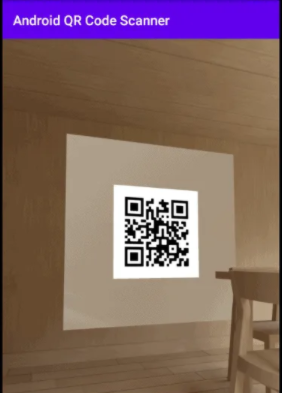

import Tabs from '@theme/Tabs';
import TabItem from '@theme/TabItem';
import TooltipWithDefaults from '../src/components/TooltipWithDefaults';
import Tip from '../src/components/Tip';

*Docs for the iOS SDK are [here](mobile-sdk-ios).*

This is a lightweight, fully native SDK that allows a host app to receive and store <Tip type="credential">credentials</Tip>, receive <Tip type="request">requests</Tip>, and share <Tip type="presentation">presentations</Tip>. It works with both Kotlin and Java native apps.

**Before you begin:** You need to be registered as Unum ID customer, and you need to register at least one <Tip type="holder app"/>. (You can register zero to many, depending on your use case.) You'll receive a holder app API key to use with this SDK.

:::note
More detailed but less styled documentation can be found [here](http://docs.unum.id/Holder-SDK-Android/). This serves as a useful technical reference.
:::

## Overview

### Minimum Requirements
- **Android 6.0 (Marshmallow) and above**
- **English language** (internationalization coming soon)

### Required Permissions
- **Camera:** requested when you show the QR code scanner
- **Biometrics/Passcode:** requested when you call `initialize()`

These permissions are requested by the SDK — no action is required by the host app. 

Because the SDK leverages the secure hardware of the user's device for cryptographic operations, it requires OS level user authentication. This means **the user must have a lock screen biometric, passcode, or similar.** If the user doesn't have this set up, the SDK will prompt the user and direct them to the correct place in Settings to do so.

:::note
Device biometrics are typically *aliases* for passcodes (or similar options like PINs and patterns) and fall back to those. This is all handled at the OS level.
:::

## Setup

### Installation

When you register a <Tip type="holder app"/>, we will send you the SDK as a compiled binary library.

### Initialization

You should initialize the SDK when the app starts up. This will ensure the SDK is set up properly. 

You can optionally include a <Tip type="DID"/> (`did`), which identifies a user (technically called a <Tip type="subject"/>) in the Unum ID ecosystem. A returning user will already have a DID, so you should include this to ensure the SDK loads any new credentials associated with that DID as part of the initialization process. 

You can optionally include the `UnumCallback` to be notified of the result of the initialization call.

<Tabs
    groupId="languages"
    defaultValue="kotlin"
    values={[
        {label: 'Kotlin', value: 'kotlin'},
        {label: 'Java', value: 'java'}
    ]}>
  <TabItem value="kotlin">

```kotlin
initialize({
    customerId(BuildConfig.CUSTOMER_ID) // your customer UUID
    apiKey(BuildConfig.API_KEY) // your holder app API key
    onError(::onErrorFunction) // (optional) run if there's an error
    did(did) // (optional) include this for returning users — otherwise leave empty
},
object : UnumCallback {
    override fun onSuccess(data: String?) {
        data?.let {
            val did = data
            // store DID — associate with user in your database
         }
    }

    override fun onSDKError(error: String?) {

    }

    override fun onAPIError(code: Int, error: String?) {

    }
})
```
  </TabItem>
  <TabItem value="java">

```java
UnumInitializationConfiguration configuration = new UnumInitializationConfiguration.Builder()
    .customerId(BuildConfig.CustomerId) // your customer UUID
    .apiKey(BuildConfig.ApiKey) // your holder app API key
    .onError(() -> { // (optional) run if there's an error
        onErrorFunction();
        return null;
    })
    .did(did) // (optional) include this for returning users — otherwise leave empty
    .build();

UnumId.INSTANCE.initialize(configuration, new UnumCallback() {
    @Override
    public void onSuccess(Object data) {
        if (data != null && data instanceof String) {
            // returned data is string version of subject (user) DID
            // store DID — associate with user in your database
        }
    }

    @Override
    public void onSDKError(@Nullable String error) {
        Log.e("MainActivity", "SDK Error");
    }

    @Override
    public void onAPIError(int code, @Nullable String error) {
        Log.e("MainActivity", "API Error");
    }
});
```
  </TabItem>
</Tabs>

The initialization process involves creating private keys for the user using the secure hardware of the device. This requires OS level authentication, so the user will be prompted to pass a biometric check, enter their passcode, or authenticate in an analogous way. If they don't have this set up, the SDK will direct them to the correct place in Settings to do so.

### Deep Links

In the context of Unum ID, a **deep link** is a URL that opens a specific <Tip type="holder app"/>. For example, a link that opens the ACME Bank mobile app might look like this:

```
unumid://acme/presentationRequest/88d37012-f83b-453a-a1f1-d4a1bcf86aa3
```

The SDK uses deep links to retrieve and display a <Tip type="request"/> to a user, who decides whether to share data in response. Users will typically encounter deep links displayed in the [Web SDK](/web-sdk) (in QR code or button form) or sent over a communication channel (like push notification, SMS, or email).

You need to pass Unum ID deep links to the SDK to be processed. To do so, set up an activity as shown below. This will catch a deep link like the example one shown above.

```xml
<activity android:name=".MainActivity">
    <intent-filter>
        <action android:name="android.intent.action.VIEW" />

        <category android:name="android.intent.category.DEFAULT" />
        <category android:name="android.intent.category.BROWSABLE" />

        <data
            android:host="unumid"
            android:scheme="acme" />
    </intent-filter>
</activity>
```

When it receives a deep link, the SDK will display a system alert, asking the user how they want to respond to the <Tip type="request"/> (that the deep link references).


The SDK will do the following based on the user's action. If the user clicks:
- **"Yes":** the SDK will send a <Tip type="presentation"/> (of the requested <Tip type="credentiaal">credentials</Tip>) to the company that made the request.
- **"No":** the SDK will send an empty presentation that indicates that the user declined the request.
- **"Something's wrong...":** the SDK will flag the request as suspicious.

### QR Code Scanner

The Unum ID [deep links](#/deep-links) described above can be displayed in QR code form. This is important for cases when a user is on a non-mobile device. For example, the ACME Bank website might request that a user share an authentication credential to log into the ACME website on desktop. ACME would do so by displaying a QR code that the user scans. This would open the ACME mobile app on the user's phone and prompt the user to share the requested data.

Any QR code scanner can read an Unum ID deep link in QR code form. Some but not all devices support scanning directly from the native camera, so you should make it possible for the user to scan codes from within your app. 

If you already have a QR code scanner, you can pass QR codes directly to the SDK like so:

<Tabs
    groupId="languages"
    defaultValue="kotlin"
    values={[
        {label: 'Kotlin', value: 'kotlin'},
        {label: 'Java', value: 'java'}
    ]}>
    <TabItem value="kotlin">

``` kotlin
UnumId.handleLink(Uri.parse(qrCode))
```

</TabItem>
<TabItem value="java">

```java
UnumId.INSTANCE.handleLink(Uri.parse(qrCode));
```

</TabItem>
</Tabs>

If you don't have a QR code scanner, you can use the one included in the SDK. Simply start the QR code activity as shwon below. This will automatically pass the deep link to the SDK — no further action is needed from the host app.

<Tabs
    groupId="languages"
    defaultValue="kotlin"
    values={[
        {label: 'Kotlin', value: 'kotlin'},
        {label: 'Java', value: 'java'}
    ]}>
    <TabItem value="kotlin">

```kotlin
private fun showQRCodeScanner() {
    val launchIntent = UnumQRCodeActivity.getLaunchIntent(this, true, false)
    startActivityForResult(launchIntent, REQUEST_CODE)
}

override fun onActivityResult(requestCode: Int, resultCode: Int, data: Intent?) {
    super.onActivityResult(requestCode, resultCode, data)

    if (requestCode == REQUEST_CODE && data != null) {
        val barcode: Barcode? =
            data.getParcelableExtra(UnumQRCodeActivity.KEY_CAPTURED_BARCODE)
        barcode?.let {
            Toast.makeText(this, barcode.rawValue, Toast.LENGTH_LONG).show()
        }
    }
    }
```

</TabItem>
<TabItem value="java">

```java
private void startQRCodeScanner() {
    Intent launch = UnumQRCodeActivity.Companion.getLaunchIntent(
            QrCodeScannerActivity.this,
            true,
            false);
    startActivityForResult(launch, REQUEST_CODE);
}

@Override
protected void onActivityResult(int requestCode, int resultCode, @Nullable Intent data) {
    super.onActivityResult(requestCode, resultCode, data);

    if (requestCode == REQUEST_CODE && data != null) {
        Barcode barcode = data.getParcelableExtra(UnumQRCodeActivity.Companion.getKEY_CAPTURED_BARCODE());
        if (barcode != null) {
            Toast.makeText(this, barcode.rawValue, Toast.LENGTH_LONG).show();
        }
    }
}
```

</TabItem>
</Tabs>

You can call this on a trigger of your choice. For example, you can create a "Scan QR Code" button that starts the activity when the user clicks it.

The QR code scanner lookss like this:



### Callback

You can pass the `UnumCallback` to most method calls within the SDK. This adds a listener that records the result of the method call – a successful call, an SDK error, or an API error. The [Initialization](#initialization) section shows one example of this, and here's another:

<Tabs
    groupId="languages"
    defaultValue="kotlin"
    values={[
        {label: 'Kotlin', value: 'kotlin'},
        {label: 'Java', value: 'java'}
    ]}>
    <TabItem value="kotlin">

```kotlin
initialize({
    customerId(BuildConfig.CUSTOMER_ID)
    apiKey(BuildConfig.API_KEY)
    onError(::onErrorFunction)
},
object : UnumCallback {
    override fun onSuccess(data: Any?) {
        data?.let {
            if (it is String && it.isNotEmpty()) {
                // do something with returned data
            }
         }
    }

    override fun onSDKError(error: String?) {
        Log.e("MainActivity", "SDK Error");
        // view string error
    }

    override fun onAPIError(code: Int, error: String?) {
        Log.e("MainActivity", "API Error");
        // view string error
    }
})
```
  </TabItem>
  <TabItem value="java">

```java

UnumId.INSTANCE.initialize(configuration, new UnumCallback() {
    @Override
    public void onSuccess(Object data) {
        if (data != null && data instanceof String) {
            // do something with returned data
        }
    }

    @Override
    public void onSDKError(@Nullable String error) {
        Log.e("MainActivity", "SDK Error");
        // view string error
    }

    @Override
    public void onAPIError(int code, @Nullable String error) {
        Log.e("MainActivity", "API Error");
        // view string error
    }
});
```
  </TabItem>
</Tabs>

## Handling Multiple Users

Each user is identified by some user ID in your system and by a <Tip type="DID"/> in the Unum ID ecosystem. You simply need to store an association between each user ID and DID. That way, when your host app has a particular user ID (for example once a user is logged into your existing account system), it can pass the corresponding DID to the SDK.

If you don't have existing user IDs, you *could* use the DIDs themselves as user IDs. However, we recommend using separate identifiers (internal to your company), to distinguish them from DIDs, which are global to the Unum ID ecosystem.

:::note
The technical details of DIDs are not relevant to deploying or using Unum ID. You can think of DIDs as identifiers in the normal sense — unique, random strings of characters like UUIDs.
:::

When you [initialize](#initialize) the SDK, you can optionally include a DID. 
- **Don't include a DID for user who's new to the SDK.** The SDK will generate a new one that you should store, associated with the user ID in your system.
- **Do include a DID for a user who returns to the SDK.** The SDK will use this DID to access the correct stored data for that user.

:::important
DIDs are the *only* identifiers the SDK understands, so it relies entirely on the host app to pass the correct one. 

For example, suppose Users 1 and 2 are associated with DIDs 1 and 2, respectively. If User 1 is using the host app, but the app passes DID 2 to the SDK, the SDK will give User 1 access to to User 2's data.
:::

### Example Flow

1. **New User 1 logs into host app.**
    - SDK is initialized with no DID.
    - SDK returns newly generated DID 1.
    - Host app stores DID 1 and associates it with User 1.
2. **New User 2 logs into host app.**
    - SDK is initialized with no DID.
    - SDK returns newly generated DID 2.
    - Host app stores DID 2 and associates it with User 2.
3. **Returning User 1 logs into host app.**
    - Host app retrieves DID 1 and includes it in SDK initialization.
    - SDK recognizes this is a returning user and does not generate a new DID.