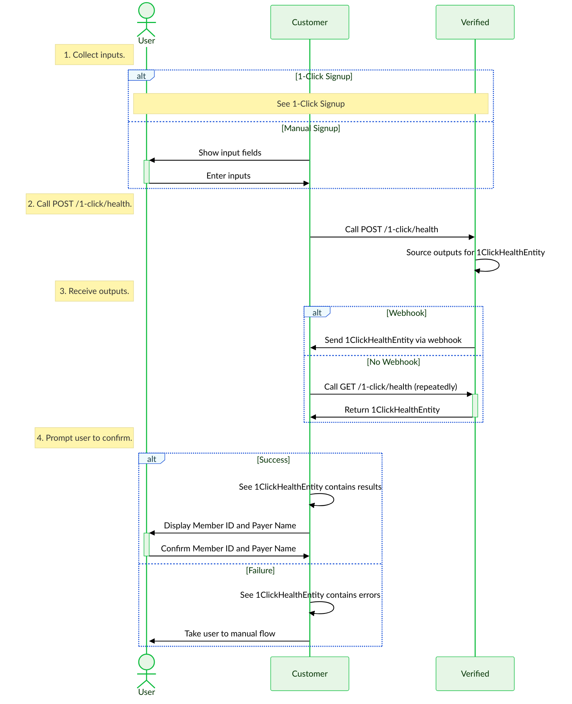

```mermaid
%%{
    init: {
    'theme': 'base',
    'themeVariables': {
        'primaryColor': '#e6f6e6',
        'primaryTextColor': '#003100',
        'primaryBorderColor': '#0dbc3d',
        'secondaryColor': '#eef9fd',
        'secondaryTextColor': '#193c47',
        'secondaryBorderColor': '#164fd6',
        'activationBkgColor': '#e6f6e6',
        'activationBorderColor': '#0dbc3d',
        'labelBoxBkgColor': '#eef9fd',
        'labelBoxBorderColor': '#164fd6',
        'labelTextColor': '#193c47',
        'edgeLabelBackground': '#ffffff',
        'textColor': '#000000',
        'fontFamily': 'Lato'
    }
}
}%%
sequenceDiagram
    actor U as User
    participant C as Customer
    participant V as Verified

    Note left of U: 1. Collect inputs.
    alt 1-Click Signup
        Note over U, V: See 1-Click Signup
    else Manual Signup
        C ->>+ U: Show input fields
        U ->>- C: Enter inputs
    end
    Note left of U: 2. Call POST /1-click/health.
    C ->> V: Call POST /1-click/health
    V ->> V: Source outputs for 1ClickHealthEntity
    Note left of U: 3. Receive outputs.
    alt Webhook
        V ->> C: Send 1ClickHealthEntity via webhook
    else No Webhook
        C ->>+ V: Call GET /1-click/health (repeatedly)
        V ->>- C: Return 1ClickHealthEntity
    end
    Note left of U: 4. Prompt user to confirm.
    alt Success
        C ->> C: See 1ClickHealthEntity contains results
        C ->>+ U: Display Member ID and Payer Name
        U ->>- C: Confirm Member ID and Payer Name
    else Failure
        C ->> C: See 1ClickHealthEntity contains errors
        C ->>+U: Take user to manual flow
    end
```
 