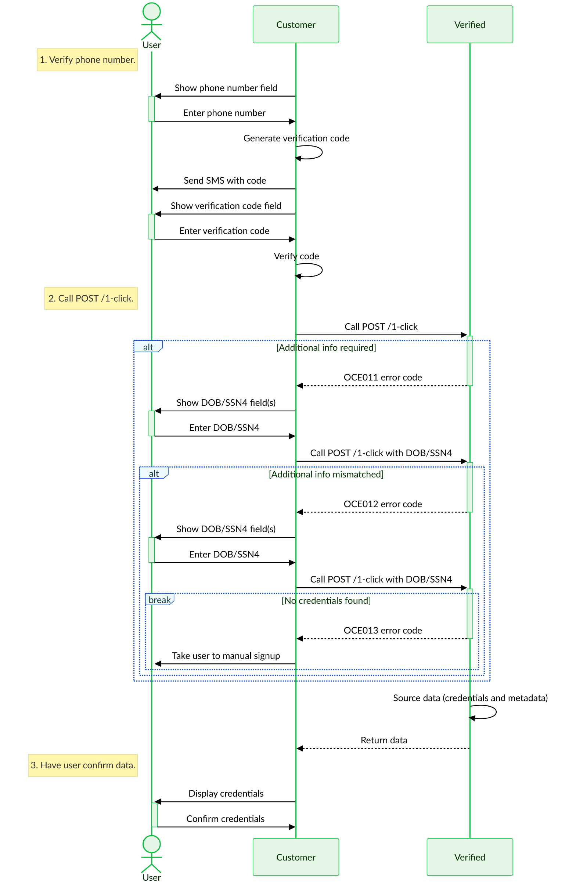

```mermaid
%%{
    init: {
    'theme': 'base',
    'themeVariables': {
        'primaryColor': '#e6f6e6',
        'primaryTextColor': '#003100',
        'primaryBorderColor': '#0dbc3d',
        'secondaryColor': '#eef9fd',
        'secondaryTextColor': '#193c47',
        'secondaryBorderColor': '#164fd6',
        'activationBkgColor': '#e6f6e6',
        'activationBorderColor': '#0dbc3d',
        'labelBoxBkgColor': '#eef9fd',
        'labelBoxBorderColor': '#164fd6',
        'labelTextColor': '#193c47',
        'edgeLabelBackground': '#ffffff',
        'textColor': '#000000',
        'fontFamily': 'Lato'
    }
}
}%%
sequenceDiagram
    actor U as User
    participant C as Customer
    participant V as Verified

    Note left of U: 1. Verify phone number.
    C ->>+ U: Show phone number field
    U ->>- C: Enter phone number
    C ->> C: Generate verification code
    C ->> U: Send SMS with code
    C ->>+ U: Show verification code field
    U ->>- C: Enter verification code
    C ->> C: Verify code
    Note left of U: 2. Call POST /1-click.
    C ->>+ V: Call POST /1-click
    alt Additional info required
        V -->>- C: OCE011 error code
        C ->>+ U: Show DOB/SSN4 field(s)
        U ->>- C: Enter DOB/SSN4
        C ->>+ V: Call POST /1-click with DOB/SSN4
        alt Additional info mismatched
            V -->>- C: OCE012 error code
            C ->>+ U: Show DOB/SSN4 field(s)
            U ->>- C: Enter DOB/SSN4
            C ->>+ V: Call POST /1-click with DOB/SSN4
            break No credentials found
                V -->>- C: OCE013 error code
                C ->>+ U: Take user to manual signup
            end
        end
    end
    V ->> V: Source data (credentials and metadata)
    V -->> C: Return data
    Note left of U: 3. Have user confirm data.
    C ->>+ U: Display credentials
    U ->>- C: Confirm credentials
```
 