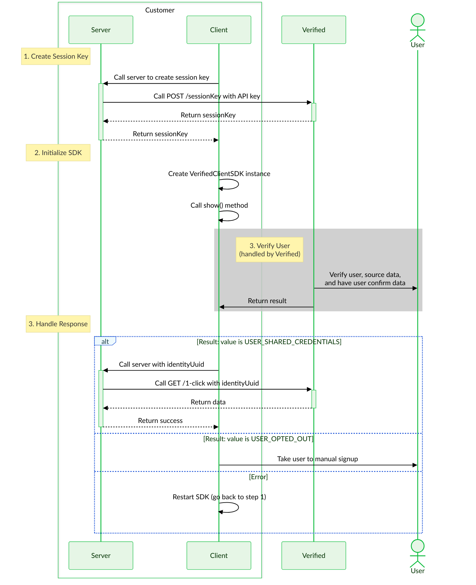

{/* ```mermaid
%%{
    init: {
        'theme': 'base',
        'themeVariables': {
            'primaryColor': '#e6f6e6',
            'primaryTextColor': '#003100',
            'primaryBorderColor': '#0dbc3d',
            'secondaryColor': '#eef9fd',
            'secondaryTextColor': '#193c47',
            'secondaryBorderColor': '#164fd6',
            'activationBkgColor': '#e6f6e6',
            'activationBorderColor': '#0dbc3d',
            'labelBoxBkgColor': '#eef9fd',
            'labelBoxBorderColor': '#164fd6',
            'labelTextColor': '#193c47',
            'edgeLabelBackground': '#ffffff',
            'textColor': '#000000',
            'fontFamily': 'Lato'
        }
    }
}%%
sequenceDiagram
    participant S as Customer Server
    participant C as Customer Client
    actor U as User
    participant V as Verified
    rect rgb(200,200,200,0.25)
        note left of S: 1. Call Session Key Endpoint
        S->>+V: Call POST /sessionKey
        V-->>-S: Return sessionKey
        S->>C: Pass sessionKey
        note left of S: 2. Initialize SDK
        C->>C: Initialize SDK
        rect rgb(200,200,200,0.85)
            note right of V: 3. Verify User (handled by Verified)
            V->>+U: Show phone number input
            U->>-V: Enter phone number
            V->>V: Generate verification code
            V->>U: Send SMS with code
            V->>+U: Show code input
            U->>-V: Enter code
            V->>V: Verify code
            alt Additional info required
                V->>+U: Show DOB/SSN4 input(s)
                U->>-V: Enter DOB/SSN4
                alt Additional info mismatched
                    V->>+U: Show DOB/SSN4 input(s)
                    U->>-V: Enter DOB/SSN4
                end
            end
            V->>V: Source data (credentials and metadata)
            V->>+U: Display credentials
            U->>-V: Consent to share data
            V-->>C: Show suCess and/or redirect user
        end
        note left of S: 3. Receive Data
        C->>C: ACess UUID from SDK or parse identityUuid from URL param
        C->>S: Pass UUID
        S->>+V: Call GET /1-click with UUID
        V-->>-S: Return data
    end
```
<br /> */}