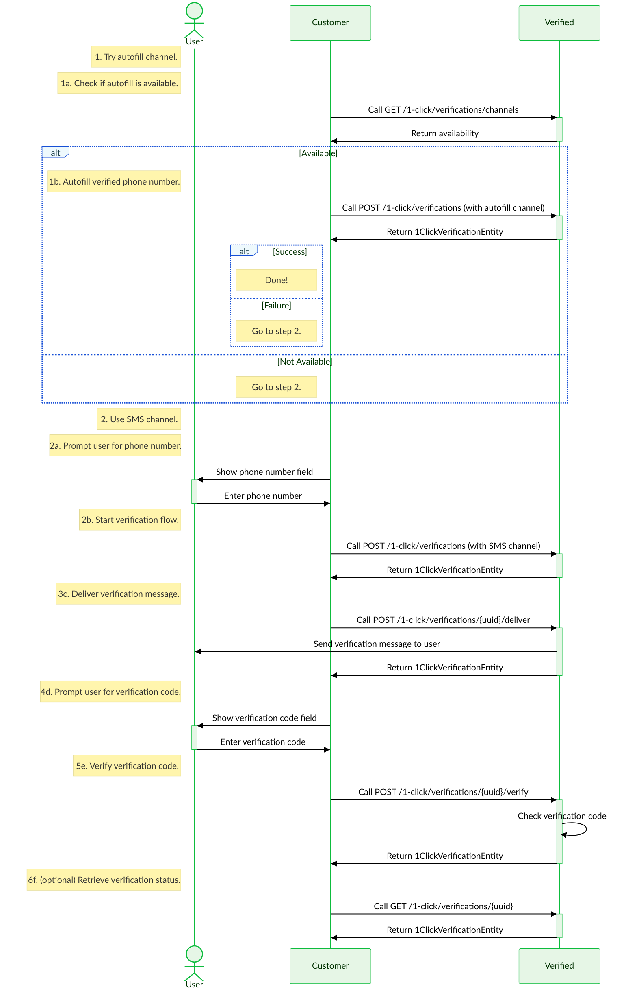

```mermaid
%%{
    init: {
    'theme': 'base',
    'themeVariables': {
        'primaryColor': '#e6f6e6',
        'primaryTextColor': '#003100',
        'primaryBorderColor': '#0dbc3d',
        'secondaryColor': '#eef9fd',
        'secondaryTextColor': '#193c47',
        'secondaryBorderColor': '#164fd6',
        'activationBkgColor': '#e6f6e6',
        'activationBorderColor': '#0dbc3d',
        'labelBoxBkgColor': '#eef9fd',
        'labelBoxBorderColor': '#164fd6',
        'labelTextColor': '#193c47',
        'edgeLabelBackground': '#ffffff',
        'textColor': '#000000',
        'fontFamily': 'Lato'
    }
}
}%%
sequenceDiagram
    actor U as User
    participant C as Customer
    participant V as Verified

    Note left of U: 1. Try autofill channel.
    Note left of U: 1a. Check if autofill is available.
    C ->>+ V: Call GET /1-click/verifications/channels
    V ->>- C: Return availability
    alt Available
        Note left of U: 1b. Autofill verified phone number.
        C ->>+ V: Call POST /1-click/verifications (with autofill channel)
        V ->>- C: Return 1ClickVerificationEntity
        alt Success
            Note left of C: Done!
        else Failure
            Note left of C: Go to step 2.
        end
    else Not Available
        Note left of C: Go to step 2.
    end
    

    Note left of U: 2. Use SMS channel.
    Note left of U: 2a. Prompt user for phone number.
    C ->>+ U: Show phone number field
    U ->>- C: Enter phone number
    Note left of U: 2b. Start verification flow.
    C ->>+ V: Call POST /1-click/verifications (with SMS channel)
    V ->>- C: Return 1ClickVerificationEntity
    Note left of U: 3c. Deliver verification message.
    C ->>+ V: Call POST /1-click/verifications/{uuid}/deliver
    V ->> U: Send verification message to user
    V ->>- C: Return 1ClickVerificationEntity
    Note left of U: 4d. Prompt user for verification code.
    C ->>+ U: Show verification code field
    U ->>- C: Enter verification code
    Note left of U: 5e. Verify verification code.
    C ->>+ V: Call POST /1-click/verifications/{uuid}/verify
    V ->> V: Check verification code
    V ->>- C: Return 1ClickVerificationEntity
    Note left of U: 6f. (optional) Retrieve verification status.
    C ->>+ V: Call GET /1-click/verifications/{uuid}
    V ->>- C: Return 1ClickVerificationEntity
```
 