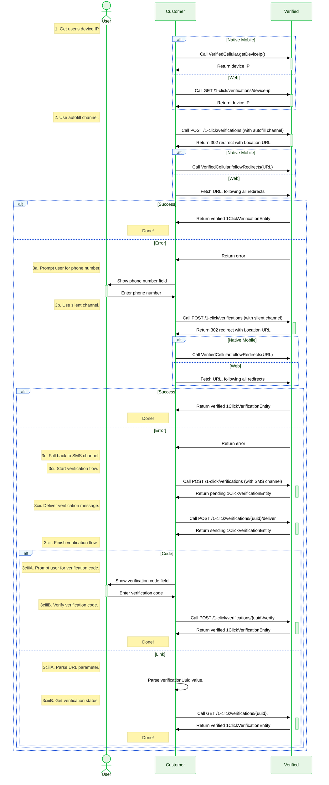

```mermaid
%%{
    init: {
    'theme': 'base',
    'themeVariables': {
        'primaryColor': '#e6f6e6',
        'primaryTextColor': '#003100',
        'primaryBorderColor': '#0dbc3d',
        'secondaryColor': '#eef9fd',
        'secondaryTextColor': '#193c47',
        'secondaryBorderColor': '#164fd6',
        'activationBkgColor': '#e6f6e6',
        'activationBorderColor': '#0dbc3d',
        'labelBoxBkgColor': '#eef9fd',
        'labelBoxBorderColor': '#164fd6',
        'labelTextColor': '#193c47',
        'edgeLabelBackground': '#ffffff',
        'textColor': '#000000',
        'fontFamily': 'Lato'
    }
}
}%%
sequenceDiagram
    actor U as User
    participant C as Customer
    participant V as Verified

    Note left of U: 1. Get user's device IP.
    alt Native Mobile
        C ->>+ V: Call VerifiedCellular.getDeviceIp()
        V ->>- C: Return device IP
    else Web
        C ->>+ V: Call GET /1-click/verifications/device-ip
        V ->>- C: Return device IP
    end
    
    Note left of U: 2. Use autofill channel.
    C ->>+ V: Call POST /1-click/verifications (with autofill channel)
    V ->>- C: Return 302 redirect with Location URL
    alt Native Mobile
        C ->>+ V: Call VerifiedCellular.followRedirects(URL)
    else Web
        C ->>+ V: Fetch URL, following all redirects
    end
    alt Success
        V ->> C: Return verified 1ClickVerificationEntity
        Note left of C: Done!
    else Error
        V ->> C: Return error

        Note left of U: 3a. Prompt user for phone number.
        C ->>+ U: Show phone number field
        U ->>- C: Enter phone number

        Note left of U: 3b. Use silent channel.
        C ->>+ V: Call POST /1-click/verifications (with silent channel)
        V ->>- C: Return 302 redirect with Location URL
        alt Native Mobile
            C ->>+ V: Call VerifiedCellular.followRedirects(URL)
        else Web
            C ->>+ V: Fetch URL, following all redirects
        end
        alt Success
            V ->> C: Return verified 1ClickVerificationEntity
            Note left of C: Done!
        else Error
            V ->> C: Return error

            Note left of U: 3c. Fall back to SMS channel.

            Note left of U: 3ci. Start verification flow.
            C ->>+ V: Call POST /1-click/verifications (with SMS channel)
            V ->>- C: Return pending 1ClickVerificationEntity

            Note left of U: 3cii. Deliver verification message.
            C ->>+ V: Call POST /1-click/verifications/{uuid}/deliver
            V ->>- C: Return sending 1ClickVerificationEntity

            Note left of U: 3ciii. Finish verification flow.
            alt Code

                Note left of U: 3ciiiA. Prompt user for verification code.
                C ->>+ U: Show verification code field
                U ->>- C: Enter verification code

                Note left of U: 3ciiiB. Verify verification code.
                C ->>+ V: Call POST /1-click/verifications/{uuid}/verify
                V ->>- C: Return verified 1ClickVerificationEntity
                Note left of C: Done!
            else Link

                Note left of U: 3ciiiA. Parse URL parameter.
                C ->> C: Parse verificationUuid value.

                Note left of U: 3ciiiB. Get verification status.
                C ->>+ V: Call GET /1-click/verifications/{uuid}.
                V ->>- C: Return verified 1ClickVerificationEntity
                Note left of C: Done!
            end
        end
    end
```
 