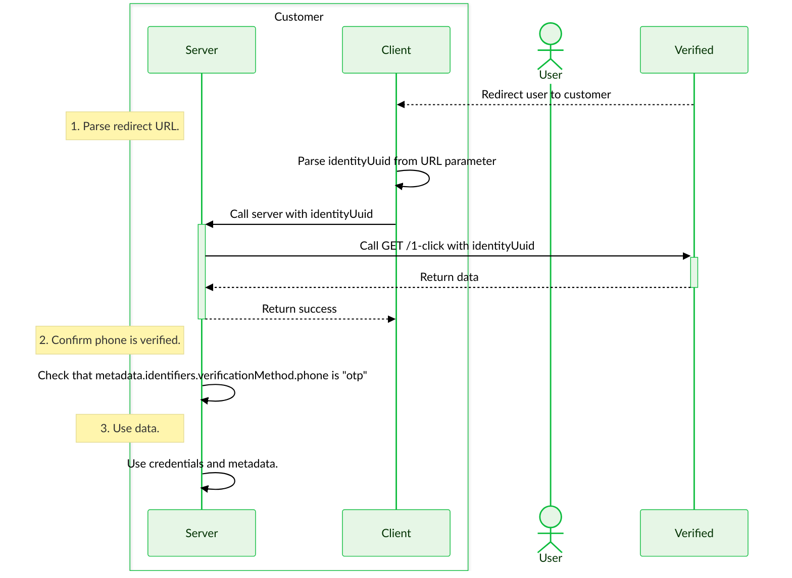

```mermaid
%%{
    init: {
        'theme': 'base',
        'themeVariables': {
            'primaryColor': '#e6f6e6',
            'primaryTextColor': '#003100',
            'primaryBorderColor': '#0dbc3d',
            'secondaryColor': '#eef9fd',
            'secondaryTextColor': '#193c47',
            'secondaryBorderColor': '#164fd6',
            'activationBkgColor': '#e6f6e6',
            'activationBorderColor': '#0dbc3d',
            'labelBoxBkgColor': '#eef9fd',
            'labelBoxBorderColor': '#164fd6',
            'labelTextColor': '#193c47',
            'edgeLabelBackground': '#ffffff',
            'textColor': '#000000',
            'fontFamily': 'Lato'
        }
    }
}%%
sequenceDiagram
    box Customer
        participant S as Server
        participant C as Client
    end
    actor U as User
    participant V as Verified
    V -->> C: Redirect user to customer
    note left of S: 1. Parse redirect URL.
    C ->> C: Parse identityUuid from URL parameter
    C ->>+ S: Call server with identityUuid
    S ->>+ V: Call GET /1-click with identityUuid
    V -->>- S: Return data
    S -->>- C: Return success
    note left of S: 2. Confirm phone is verified.
    S ->> S: Check that metadata.identifiers.verificationMethod.phone is "otp"
    note left of S: 3. Use data.
    S ->> S: Use credentials and metadata.
```