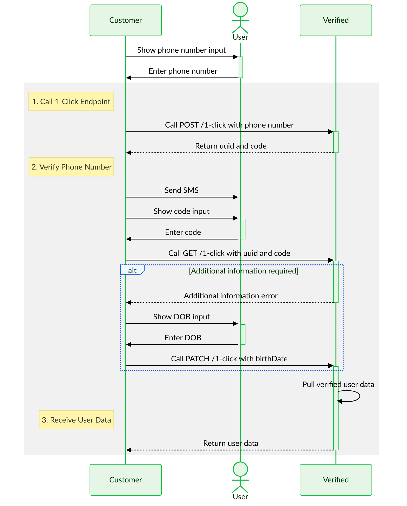

Here is the **Sequence Diagram** for the **Semi-Hosted** integration type:

```mermaid
%%{
    init: {
    'theme': 'base',
    'themeVariables': {
        'primaryColor': '#e6f6e6',
        'primaryTextColor': '#003100',
        'primaryBorderColor': '#0dbc3d',
        'secondaryColor': '#eef9fd',
        'secondaryTextColor': '#193c47',
        'secondaryBorderColor': '#164fd6',
        'activationBkgColor': '#e6f6e6',
        'activationBorderColor': '#0dbc3d',
        'labelBoxBkgColor': '#eef9fd',
        'labelBoxBorderColor': '#164fd6',
        'labelTextColor': '#193c47',
        'edgeLabelBackground': '#ffffff',
        'textColor': '#000000',
        'fontFamily': 'Lato'
    }
}
}%%
sequenceDiagram
    participant C as Customer
    actor U as User
    participant V as Verified

    C ->>+ U: Show phone number input
    U ->>- C: Enter phone number
    rect rgb(200,200,200,0.25)
        Note left of C: 1. Call 1-Click Endpoint
        C ->>+ V: Call POST /1-click with phone number
        V -->>- C: Return uuid and code
        Note left of C: 2. Verify Phone Number
        C ->>+ U: Send SMS
        C ->>+ U: Show code input
        U ->>- C: Enter code
        C ->>+ V: Call GET /1-click with uuid and code
        alt Additional information required
            V -->>- C: Additional information error
            C ->>+ U: Show DOB input
            U ->>- C: Enter DOB
            C ->>+ V: Call PATCH /1-click with birthDate
        end
        V ->> V: Pull verified user data
        Note left of C: 3. Receive User Data
        V -->>- C: Return user data
    end
```